# AgentLens Architecture

AgentLens is a VS Code extension that receives OpenTelemetry (OTLP) telemetry from AI coding agents (GitHub Copilot, Claude Code, Codex), reads local session files and databases (including OpenCode's SQLite database), persists everything to a local SQLite database, summarises it into per-session cards, and visualises it in a sidebar and a full dashboard.

---

## Table of Contents

1. [System Overview](#1-system-overview)
2. [Extension Activation](#2-extension-activation)
3. [Data Ingestion Pipeline](#3-data-ingestion-pipeline)
4. [Local Log Ingestion](#4-local-log-ingestion)
5. [OTLP Collector](#5-otlp-collector)
6. [Session Summarizer](#6-session-summarizer)
7. [Per-Agent Summarizers](#7-per-agent-summarizers)
8. [SQLite Storage Layer](#8-sqlite-storage-layer)
9. [Session Data Model](#9-session-data-model)
10. [Frontend Architecture](#10-frontend-architecture)
11. [Cost Calculation](#11-cost-calculation)
12. [Auto-Configuration](#12-auto-configuration)
13. [Background Service Mode](#13-background-service-mode)
14. [Build Pipeline](#14-build-pipeline)
15. [AgentLens Pro — team link](#15-agentlens-pro--team-link)

---

## 1. System Overview

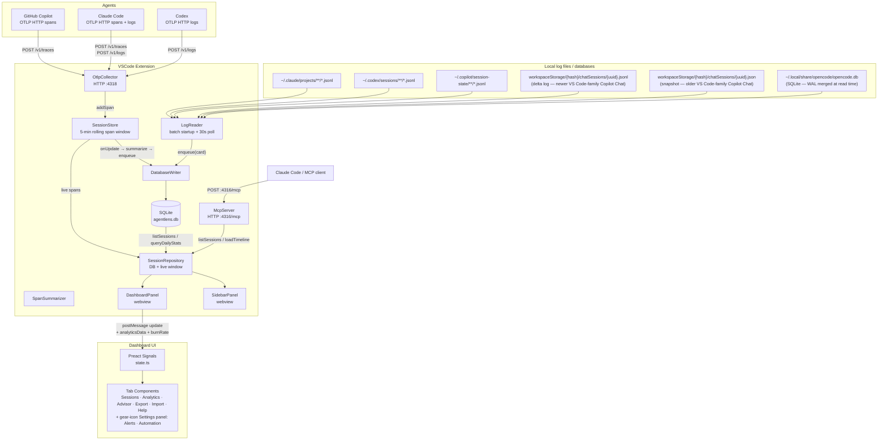
```mermaid
graph TB
    subgraph Agents
        CP[GitHub Copilot<br/>OTLP HTTP spans]
        CC[Claude Code<br/>OTLP HTTP spans + logs]
        CX[Codex<br/>OTLP HTTP logs]
    end

    subgraph LocalLogs["Local log files / databases"]
        CL_LOGS["~/.claude/projects/**/*.jsonl"]
        CX_LOGS["~/.codex/sessions/**/*.jsonl"]
        CP_LOGS["~/.copilot/session-state/**/*.jsonl"]
        CP_VS["workspaceStorage/{hash}/chatSessions/{uuid}.jsonl<br/>(delta log — newer VS Code-family Copilot Chat)"]
        CP_JSON["workspaceStorage/{hash}/chatSessions/{uuid}.json<br/>(snapshot — older VS Code-family Copilot Chat)"]
        OC_DB["~/.local/share/opencode/opencode.db<br/>(SQLite — WAL merged at read time)"]
    end

    subgraph VSCode Extension
        COL[OtlpCollector<br/>HTTP :4318]
        LR[LogReader<br/>batch startup + 30s poll]
        STO[SessionStore<br/>5-min rolling span window]
        SUM[SpanSummarizer]
        WRI[DatabaseWriter]
        DB[(SQLite<br/>agentlens.db)]
        REPO[SessionRepository<br/>DB + live window]
        MCP[McpServer<br/>HTTP :4316/mcp]
        SID[SidebarPanel<br/>webview]
        DASH[DashboardPanel<br/>webview]
    end

    AGENT_MCP[Claude Code / MCP client] -- "POST :4316/mcp" --> MCP
    MCP -- listSessions / loadTimeline --> REPO

    subgraph Dashboard UI
        STATE[Preact Signals<br/>state.ts]
        TABS[Tab Components<br/>Sessions · Analytics · Advisor · Export · Import · Help<br/>+ gear-icon Settings panel: Alerts · Automation]
    end

    CP -- "POST /v1/traces" --> COL
    CC -- "POST /v1/traces<br/>POST /v1/logs" --> COL
    CX -- "POST /v1/logs" --> COL

    COL -- addSpan --> STO
    STO -- onUpdate → summarize → enqueue --> WRI

    CL_LOGS & CX_LOGS & CP_LOGS & CP_VS & CP_JSON & OC_DB --> LR
    LR -- "enqueue(card)" --> WRI

    WRI --> DB
    DB -- listSessions / queryDailyStats --> REPO
    STO -- live spans --> REPO
    REPO --> SID
    REPO --> DASH

    DASH -- "postMessage update<br/>+ analyticsData + burnRate" --> STATE
    STATE --> TABS
```

---

## 2. Extension Activation

The extension activates in a fixed sequence.

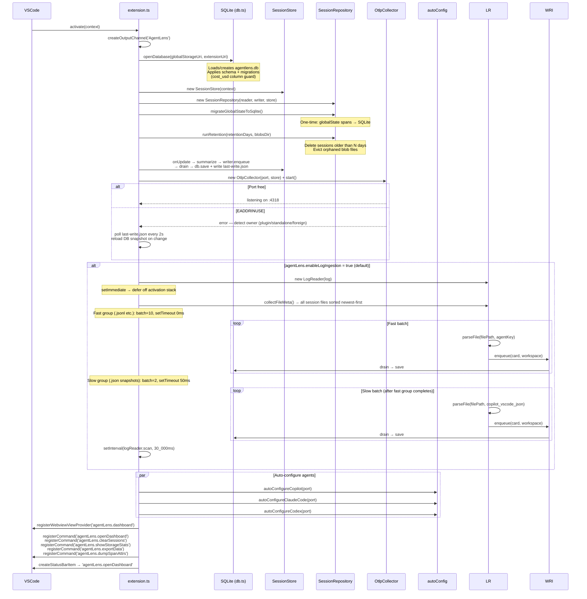
```mermaid
sequenceDiagram
    participant VS as VSCode
    participant EXT as extension.ts
    participant DB as SQLite (db.ts)
    participant STO as SessionStore
    participant REPO as SessionRepository
    participant COL as OtlpCollector
    participant CFG as autoConfig

    VS->>EXT: activate(context)
    EXT->>EXT: createOutputChannel('AgentLens')
    EXT->>DB: openDatabase(globalStorageUri, extensionUri)
    Note over DB: Loads/creates agentlens.db<br/>Applies schema + migrations<br/>(cost_usd column guard)
    EXT->>STO: new SessionStore(context)
    EXT->>REPO: new SessionRepository(reader, writer, store)
    EXT->>REPO: migrateGlobalStateToSqlite()
    Note over REPO: One-time: globalState spans → SQLite
    EXT->>REPO: runRetention(retentionDays, blobsDir)
    Note over REPO: Delete sessions older than N days<br/>Evict orphaned blob files
    EXT->>STO: onUpdate → summarize → writer.enqueue<br/>→ drain → db.save + write last-write.json
    EXT->>COL: new OtlpCollector(port, store) + start()
    alt Port free
        COL-->>EXT: listening on :4318
    else EADDRINUSE
        COL-->>EXT: error — detect owner (plugin/standalone/foreign)
        EXT->>EXT: poll last-write.json every 2s<br/>reload DB snapshot on change
    end
    alt agentLens.enableLogIngestion = true (default)
        EXT->>LR: new LogReader(log)
        Note over EXT: setImmediate → defer off activation stack
        EXT->>LR: collectFileMeta() → all session files sorted newest-first
        Note over EXT: Fast group (.jsonl etc.): batch=10, setTimeout 0ms
        loop Fast batch
            LR->>LR: parseFile(filePath, agentKey)
            LR->>WRI: enqueue(card, workspace)
            WRI->>DB: drain → save
        end
        Note over EXT: Slow group (.json snapshots): batch=2, setTimeout 50ms
        loop Slow batch (after fast group completes)
            LR->>LR: parseFile(filePath, copilot_vscode_json)
            LR->>WRI: enqueue(card, workspace)
            WRI->>DB: drain → save
        end
        EXT->>EXT: setInterval(logReader.scan, 30_000ms)
    end
    par Auto-configure agents
        EXT->>CFG: autoConfigureCopilot(port)
        EXT->>CFG: autoConfigureClaudeCode(port)
        EXT->>CFG: autoConfigureCodex(port)
    end
    EXT->>VS: registerWebviewViewProvider('agentLens.dashboard')
    EXT->>VS: registerCommand('agentLens.openDashboard')<br/>registerCommand('agentLens.clearSessions')<br/>registerCommand('agentLens.showStorageStats')<br/>registerCommand('agentLens.exportData')<br/>registerCommand('agentLens.dumpSpanAttrs')
    EXT->>VS: createStatusBarItem → 'agentLens.openDashboard'
```

---

## 3. Data Ingestion Pipeline

There are two independent ingestion paths: OTLP (network) and local log files (disk). Both converge at `DatabaseWriter`.

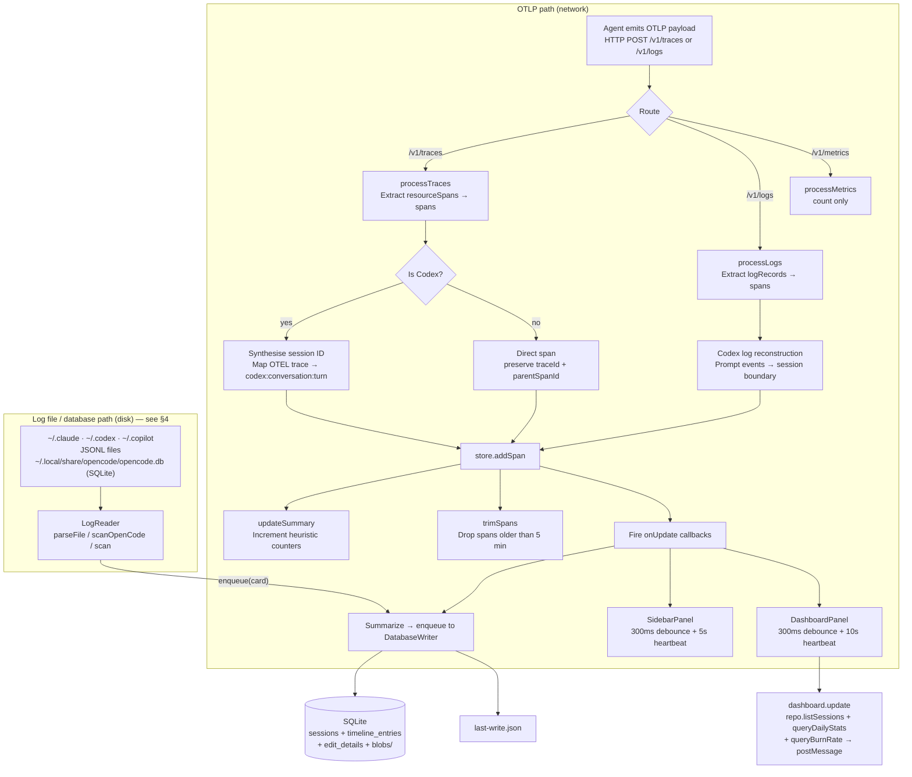
```mermaid
flowchart TD
    subgraph OTLP["OTLP path (network)"]
        A[Agent emits OTLP payload<br/>HTTP POST /v1/traces or /v1/logs] --> B{Route}

        B -- /v1/traces --> T[processTraces<br/>Extract resourceSpans → spans]
        B -- /v1/logs  --> L[processLogs<br/>Extract logRecords → spans]
        B -- /v1/metrics --> M[processMetrics<br/>count only]

        T --> NS{Is Codex?}
        NS -- yes --> CS[Synthesise session ID<br/>Map OTEL trace → codex:conversation:turn]
        NS -- no  --> DS[Direct span<br/>preserve traceId + parentSpanId]

        L --> LS[Codex log reconstruction<br/>Prompt events → session boundary]

        CS --> ADD[store.addSpan]
        DS --> ADD
        LS --> ADD

        ADD --> UPD[updateSummary<br/>Increment heuristic counters]
        ADD --> TRIM[trimSpans<br/>Drop spans older than 5 min]
        ADD --> CB[Fire onUpdate callbacks]

        CB --> WRITE[Summarize → enqueue to DatabaseWriter]
        CB --> SID_CB[SidebarPanel<br/>300ms debounce + 5s heartbeat]
        CB --> DSH_CB[DashboardPanel<br/>300ms debounce + 10s heartbeat]
    end

    subgraph LOGS["Log file / database path (disk) — see §4"]
        LF["~/.claude · ~/.codex · ~/.copilot<br/>JSONL files<br/>~/.local/share/opencode/opencode.db (SQLite)"] --> LR[LogReader<br/>parseFile / scanOpenCode / scan]
        LR -- "enqueue(card)" --> WRITE
    end

    WRITE --> SQLITE[(SQLite<br/>sessions + timeline_entries<br/>+ edit_details + blobs/)]
    WRITE --> SIG[last-write.json]

    DSH_CB --> DSH_U[dashboard.update<br/>repo.listSessions + queryDailyStats<br/>+ queryBurnRate → postMessage]
```

---

## 4. Local Log Ingestion

A parallel, network-free ingestion path that reads session files written to disk by each agent. Implemented in `src/logReader.ts` (`LogReader` class).

### File locations

| Agent | Format | Default path | Env override |
| --- | --- | --- | --- |
| Claude Code | JSONL (append log) | `~/.claude/projects/<project>/<uuid>.jsonl` | `CLAUDE_CONFIG_DIR` (comma-separated config dirs) |
| Codex | JSONL (append log) | `~/.codex/sessions/<project>/<uuid>.jsonl` | `CODEX_HOME` (comma-separated home dirs) |
| Copilot CLI | JSONL (event log) | `~/.copilot/session-state/<uuid>/events.jsonl` | — (written automatically) |
| Copilot Chat (VS Code-family, newer) | JSONL (delta log) | `workspaceStorage/<hash>/chatSessions/<uuid>.jsonl` | — |
| Copilot Chat (VS Code-family, older) | JSON (snapshot) | `workspaceStorage/<hash>/chatSessions/<uuid>.json` | — |
| OpenCode | SQLite database (WAL mode) | `~/.local/share/opencode/opencode.db` (Linux/Mac) | `OPENCODE_DATA_DIR` (comma-separated data dirs) |

`workspaceStorage` is at `~/Library/Application Support/<IDE>/User/workspaceStorage` (macOS), `%APPDATA%\<IDE>\User\workspaceStorage` (Windows), or `$XDG_CONFIG_HOME/<IDE>/User/workspaceStorage` (Linux), where `<IDE>` is any VS Code-family IDE. AgentLens scans all known VS Code-family IDEs automatically — VS Code, VS Code Insiders, Cursor, Windsurf, VSCodium, Trae, and Kiro — via `VSCODE_FAMILY_IDE_NAMES` in `src/vscodeFamilyIdes.ts`. Standalone auto-config writes Copilot settings into every installed IDE's `settings.json`. Windows: Claude Code also checks `%APPDATA%\Claude\projects`. Linux/Mac: `XDG_CONFIG_HOME` is also checked for Claude.

### Copilot Chat — delta log format (`.jsonl`)

VS Code writes one JSONL per session where each line is an operation on the session state object:

| `kind` | Meaning |
| --- | --- |
| `0` | Initial session snapshot (`creationDate`, `sessionId`, `inputState.selectedModel`) |
| `1` | Set — `k` is key path, `v` is new value (e.g. `["requests", N, "completionTokens"]`) |
| `2` | Push — `k` is key path, `v` is array of items to append |

New turn: `kind=2` with `k=["requests"]` (exactly one element). Response sub-arrays (`k=["requests", N, "response"]`) are ignored. `completionTokens` arrives via kind=1 (streaming final) and optionally embedded in the kind=2 request push object (Format B); kind=1 always wins.

### Copilot Chat — snapshot format (`.json`)

Older VS Code Copilot Chat versions wrote the full session state as a single JSON object. The `requests` array contains all turns with `message.text`, `timestamp`, `modelId`, and tool call data. No token counts are stored. Only collected when no `.jsonl` sibling exists for the same session UUID.

### OpenCode — SQLite database

OpenCode stores all session data in a local SQLite database (`opencode.db`) using WAL (Write-Ahead Log) mode. AgentLens reads the database directly using `sql.js` (WASM SQLite), merging the WAL file at read time so in-progress sessions are visible immediately.

**WAL merge:** `opencode.db-wal` can be larger than the main database file when sessions are active. `_mergeWal()` parses the 32-byte WAL header (magic, page size, salt pair), iterates frames of size `24 + pageSize`, applies frames whose salt matches the database header, and returns a merged in-memory buffer for `sql.js` to open. The WAL mtime is checked alongside the database mtime so new sessions trigger a rescan.

**Three-query parse:** `_parseOpenCodeDb()` executes three queries in one pass:

1. **Session query** — `session` table: `id, title, directory, model, time_created, tokens_input, tokens_output, tokens_cache_read, tokens_cache_write`. Filters: `parent_id` null/empty (skip sub-sessions), total tokens > 0. Model is stored as JSON (`{"id":"...", "providerID":"..."}`); the `id` field is extracted.
2. **Message query** — `message` table joined on `session_id`: per-assistant-turn timing (`time.created`, `time.completed` from the `data` JSON) and token counts.
3. **Part query** — `part` table joined with `message`: `type` (text / tool / step-start / step-finish / reasoning), `text`, `tool_name`, `callID`, `tool_input_json`, `tool_output`, `tool_status`, and timestamps. Results are grouped per session into `partsBySess` for card building.

**User request:** The last `text`-type part with `role=user` is used as `userRequest` (not the first) to capture the most recent user message in multi-turn sessions.

**Timeline:** `llmEvents` (one per assistant message, from the message query) and `toolEvents` (one per tool part, from the part query) are merged and sorted by timestamp into `TimelineEntry[]`.

### Scan mechanics

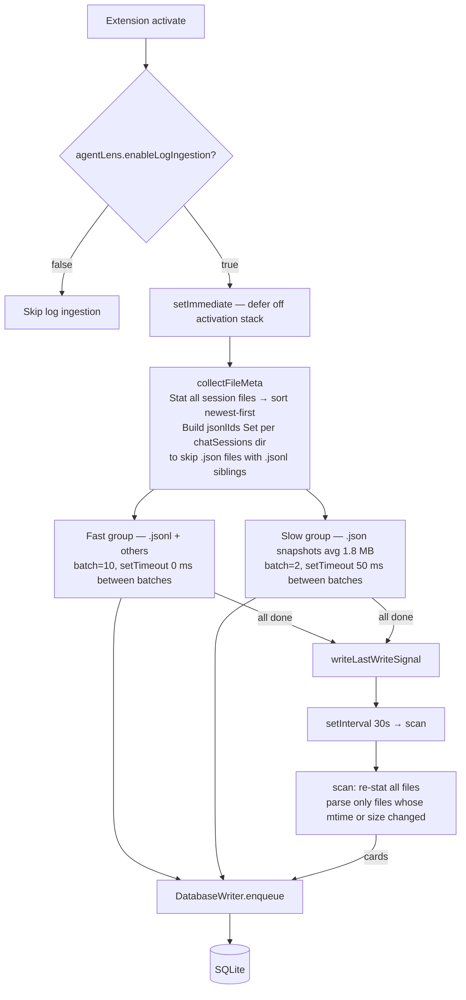
```mermaid
flowchart TD
    ACT[Extension activate] --> EN{agentLens.enableLogIngestion?}
    EN -- false --> SKIP[Skip log ingestion]
    EN -- true --> IMM[setImmediate — defer off activation stack]
    IMM --> COL[collectFileMeta<br/>Stat all session files → sort newest-first<br/>Build jsonlIds Set per chatSessions dir<br/>to skip .json files with .jsonl siblings]
    COL --> FAST[Fast group — .jsonl + others<br/>batch=10, setTimeout 0 ms between batches]
    COL --> SLOW[Slow group — .json snapshots avg 1.8 MB<br/>batch=2, setTimeout 50 ms between batches]
    FAST --> WRI[DatabaseWriter.enqueue]
    SLOW --> WRI
    WRI --> DB[(SQLite)]
    FAST -- all done --> SIGNAL[writeLastWriteSignal]
    SLOW -- all done --> SIGNAL
    SIGNAL --> TIMER[setInterval 30s → scan]
    TIMER --> INC[scan: re-stat all files<br/>parse only files whose mtime or size changed]
    INC -- cards --> WRI
```

**Incremental reads:** `_readNewLines` / `_readJsonFile` track `{ bytesRead, mtimeMs }` per file in a `Map<string, FileState>`. On each poll only files whose mtime or size has changed are re-parsed — the whole file is re-read each time (not byte-offset) to produce a complete card. `fileState` is not persisted to disk; on extension restart all files are re-scanned once.

**Two-phase startup loading:** the fast group (all non-.json files) runs first and surfaces recent sessions immediately. The slow group (legacy .json snapshots) starts after the fast group finishes, with a 50 ms gap between each 2-file batch to keep the extension host responsive (each ~60 ms parsing window).

### Data availability

| Field | OTLP | Claude / Codex logs | Copilot CLI log | Copilot Chat JSONL | Copilot Chat JSON | OpenCode SQLite |
| --- | --- | --- | --- | --- | --- | --- |
| Session ID, workspace | ✓ | ✓ | ✓ | ✓ | ✓ | ✓ |
| Model | ✓ | ✓ | ✓ | ✓ (initial model only) | ✓ (first request) | ✓ |
| Timestamps, duration | ✓ | ✓ | ✓ | ✓ | ✓ | ✓ |
| Input tokens | ✓ | ✓ | ✓ (from `session.shutdown`) | ✗ not stored | ✗ not stored | ✓ |
| Output tokens | ✓ | ✓ | ✓ | ✓ (`completionTokens` per turn) | ✗ not stored | ✓ |
| Cache read / write tokens | ✓ | ✓ | ✓ (from `session.shutdown`) | ✗ not stored | ✗ not stored | ✓ |
| User request text | ✓ | ✓ | ✓ | ✓ | ✓ | ✓ (last user message) |
| Tool calls (names) | ✓ | ✓ | ✓ | ✗ | ✗ (presence only) | ✓ |
| Tool call inputs / outputs | ✓ | ✓ | ✗ | ✗ | ✗ | ✓ |
| File paths from tools | ✓ | ✓ | ✓ | ✗ | ✗ | ✓ |
| TTFT, per-tool timing | ✓ | ✗ | ✗ | ✗ | ✗ | ✗ |
| Streaming speed, loop signals | ✓ | ✗ | ✗ | ✗ | ✗ | ✗ |
| Full turn timeline | ✓ | ✓ | ✗ | ✗ | ✗ | ✓ (LLM + tool entries) |

Sessions produced by `LogReader` carry `dataSource: 'log'` on `SessionSummaryCard`; OTLP sessions carry `dataSource: 'otel'`. The UI shows an OTEL/Log source badge on each session row.

### Bypasses SessionStore / SpanSummarizer

`LogReader` produces `SessionSummaryCard` objects directly (via `_buildCard`) and writes them straight to `DatabaseWriter`. The OTLP path's `SessionStore` and `SpanSummarizer` are not involved.

---

## 5. OTLP Collector

A minimal HTTP/1.1 server (Node `http` module) that handles three routes and maintains stateful session reconstruction for Codex.

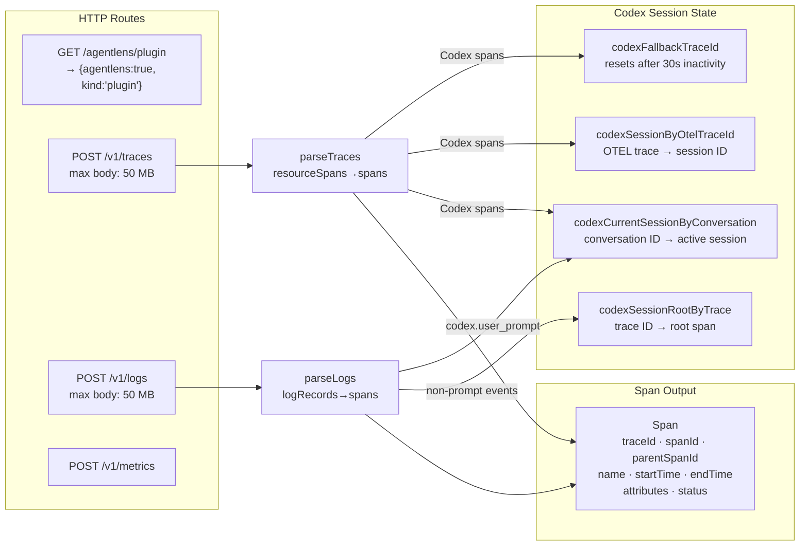
```mermaid
graph LR
    subgraph HTTP Routes
        R1["GET /agentlens/plugin<br/>→ {agentlens:true, kind:'plugin'}"]
        R2["POST /v1/traces<br/>max body: 50 MB"]
        R3["POST /v1/logs<br/>max body: 50 MB"]
        R4["POST /v1/metrics"]
    end

    subgraph Codex Session State
        S1[codexFallbackTraceId<br/>resets after 30s inactivity]
        S2[codexSessionByOtelTraceId<br/>OTEL trace → session ID]
        S3[codexCurrentSessionByConversation<br/>conversation ID → active session]
        S4[codexSessionRootByTrace<br/>trace ID → root span]
    end

    subgraph Span Output
        SP[Span<br/>traceId · spanId · parentSpanId<br/>name · startTime · endTime<br/>attributes · status]
    end

    R2 --> PT[parseTraces<br/>resourceSpans→spans]
    R3 --> PL[parseLogs<br/>logRecords→spans]

    PT -- Codex spans --> S1
    PT -- Codex spans --> S2
    PT -- Codex spans --> S3
    PL -- codex.user_prompt --> S3
    PL -- non-prompt events --> S4

    PT --> SP
    PL --> SP
```

**Key non-obvious behaviour:** Codex session IDs (`codex:{conversationId}:{turnId}`) are assigned on arrival. Once set, the mapping is immutable even if spans arrive out of order or are retried.

---

## 6. Session Summarizer

`summarizeSpans()` is called on the live rolling span window (last 5 minutes). It groups raw spans into agent-session cards and computes cross-session efficiency metrics. Historical sessions are read directly from SQLite; the two sources are merged by `SessionRepository`.

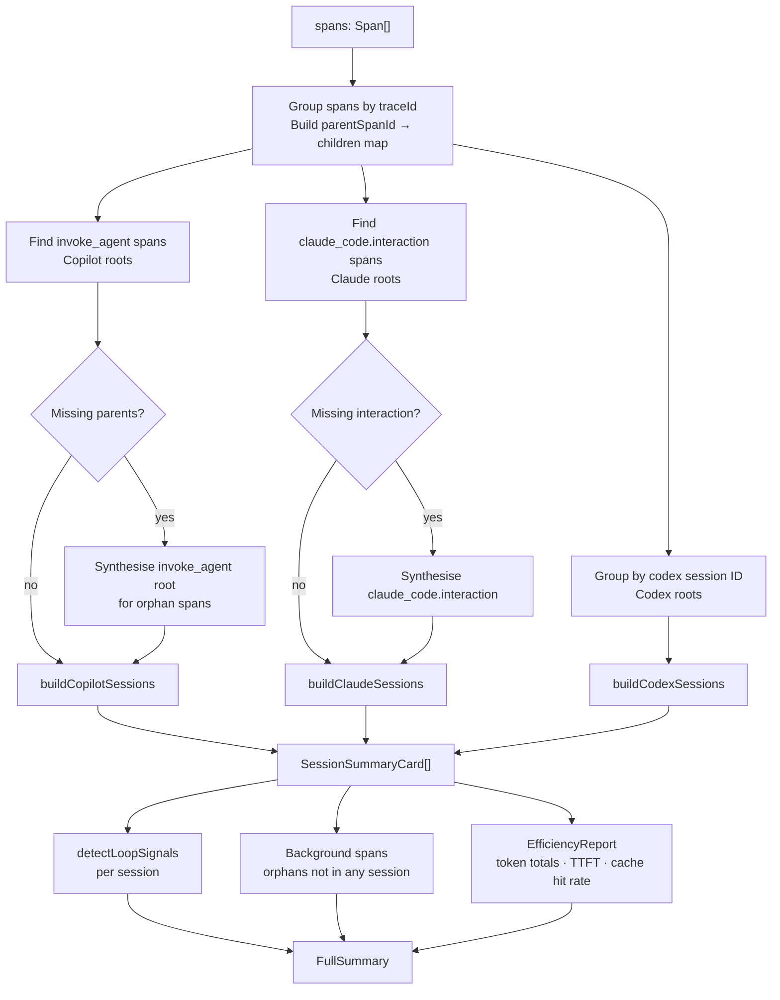
```mermaid
flowchart TD
    IN["spans: Span[]"] --> GRP[Group spans by traceId<br/>Build parentSpanId → children map]

    GRP --> CP_FIND[Find invoke_agent spans<br/>Copilot roots]
    GRP --> CC_FIND[Find claude_code.interaction spans<br/>Claude roots]
    GRP --> CX_FIND[Group by codex session ID<br/>Codex roots]

    CP_FIND --> CP_SYN{Missing parents?}
    CP_SYN -- yes --> CP_SYNTH[Synthesise invoke_agent root<br/>for orphan spans]
    CP_SYN -- no --> CP_B
    CP_SYNTH --> CP_B[buildCopilotSessions]

    CC_FIND --> CC_SYN{Missing interaction?}
    CC_SYN -- yes --> CC_SYNTH[Synthesise claude_code.interaction]
    CC_SYN -- no --> CC_B
    CC_SYNTH --> CC_B[buildClaudeSessions]

    CX_FIND --> CX_B[buildCodexSessions]

    CP_B --> SESSIONS["SessionSummaryCard[]"]
    CC_B --> SESSIONS
    CX_B --> SESSIONS

    SESSIONS --> LOOP[detectLoopSignals<br/>per session]
    SESSIONS --> BG[Background spans<br/>orphans not in any session]
    SESSIONS --> EFF[EfficiencyReport<br/>token totals · TTFT · cache hit rate]

    LOOP --> OUT[FullSummary]
    BG --> OUT
    EFF --> OUT
```

---

## 7. Per-Agent Summarizers

Each agent uses a different span structure. The summarizers normalise these into a common `SessionSummaryCard`.

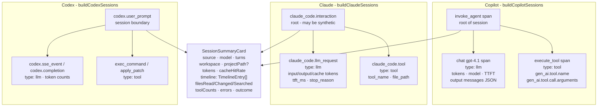
```mermaid
graph TB
    subgraph copilot["Copilot - buildCopilotSessions"]
        CP_ROOT[invoke_agent span<br/>root of session]
        CP_LLM[chat gpt-4.1 span<br/>type: llm<br/>tokens · model · TTFT<br/>output messages JSON]
        CP_TOOL[execute_tool span<br/>type: tool<br/>gen_ai.tool.name<br/>gen_ai.tool.call.arguments]
        CP_ROOT --> CP_LLM
        CP_ROOT --> CP_TOOL
    end

    subgraph claude["Claude - buildClaudeSessions"]
        CC_ROOT[claude_code.interaction<br/>root - may be synthetic]
        CC_LLM[claude_code.llm_request<br/>type: llm<br/>input/output/cache tokens<br/>ttft_ms · stop_reason]
        CC_TOOL[claude_code.tool<br/>type: tool<br/>tool_name · file_path]
        CC_ROOT --> CC_LLM
        CC_ROOT --> CC_TOOL
    end

    subgraph codex["Codex - buildCodexSessions"]
        CX_PROMPT[codex.user_prompt<br/>session boundary]
        CX_LLM[codex.sse_event / codex.completion<br/>type: llm · token counts]
        CX_TOOL[exec_command / apply_patch<br/>type: tool]
        CX_PROMPT --> CX_LLM
        CX_PROMPT --> CX_TOOL
    end

    CP_ROOT & CC_ROOT & CX_PROMPT --> CARD["SessionSummaryCard<br/>source · model · turns<br/>workspace · projectPath?<br/>tokens · cacheHitRate<br/>timeline: TimelineEntry[]<br/>filesRead/Changed/Searched<br/>toolCounts · errors · outcome"]
```

---

## 8. SQLite Storage Layer

Introduced in phases 1–4. The database is the authoritative source for all historical session data. The live 5-minute span window supplements it for in-progress sessions.

### Schema

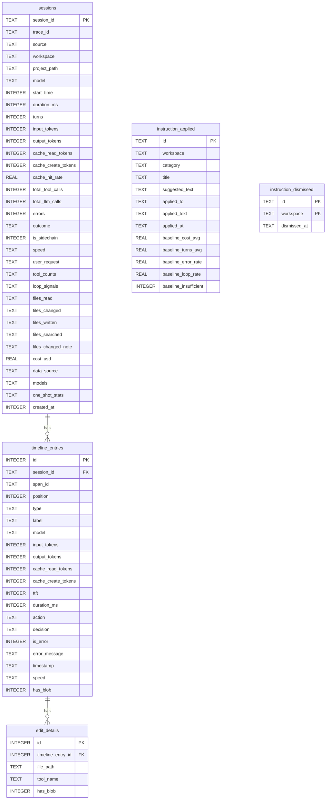
```mermaid
erDiagram
    sessions {
        TEXT session_id PK
        TEXT trace_id
        TEXT source
        TEXT workspace
        TEXT project_path
        TEXT model
        INTEGER start_time
        INTEGER duration_ms
        INTEGER turns
        INTEGER input_tokens
        INTEGER output_tokens
        INTEGER cache_read_tokens
        INTEGER cache_create_tokens
        REAL cache_hit_rate
        INTEGER total_tool_calls
        INTEGER total_llm_calls
        INTEGER errors
        TEXT outcome
        INTEGER is_sidechain
        TEXT speed
        TEXT user_request
        TEXT tool_counts
        TEXT loop_signals
        TEXT files_read
        TEXT files_changed
        TEXT files_written
        TEXT files_searched
        TEXT files_changed_note
        REAL cost_usd
        TEXT data_source
        TEXT models
        TEXT one_shot_stats
        INTEGER created_at
    }
    timeline_entries {
        INTEGER id PK
        TEXT session_id FK
        TEXT span_id
        INTEGER position
        TEXT type
        TEXT label
        TEXT model
        INTEGER input_tokens
        INTEGER output_tokens
        INTEGER cache_read_tokens
        INTEGER cache_create_tokens
        INTEGER ttft
        INTEGER duration_ms
        TEXT action
        TEXT decision
        INTEGER is_error
        TEXT error_message
        TEXT timestamp
        TEXT speed
        INTEGER has_blob
    }
    edit_details {
        INTEGER id PK
        INTEGER timeline_entry_id FK
        TEXT file_path
        TEXT tool_name
        INTEGER has_blob
    }
    instruction_applied {
        TEXT id PK
        TEXT workspace
        TEXT category
        TEXT title
        TEXT suggested_text
        TEXT applied_to
        TEXT applied_text
        TEXT applied_at
        REAL baseline_cost_avg
        REAL baseline_turns_avg
        REAL baseline_error_rate
        REAL baseline_loop_rate
        INTEGER baseline_insufficient
    }
    instruction_dismissed {
        TEXT id PK
        TEXT workspace PK
        TEXT dismissed_at
    }
    sessions ||--o{ timeline_entries : "has"
    timeline_entries ||--o{ edit_details : "has"
```

Large string fields (`responseText`, `thinking`, `toolInput`, `fullResult`, `oldString`, `newString`) above 512 bytes are stored as files at `globalStorageUri/blobs/<spanId>-<field>.txt` rather than inline in the DB. The `has_blob` flag indicates when to read from disk instead.

`one_shot_stats` (added for the one-shot/retry-rate metric) and `instruction_applied`/`instruction_dismissed` (added for the Advisor tab's instruction-suggestion tracking) are not tied to `sessions` by a foreign key in the diagram above — the former is a column on `sessions`, the latter two are keyed by `workspace` (a free-text column, not `sessions.workspace` as an FK) since suggestions are workspace-scoped, not session-scoped.

### Component responsibilities

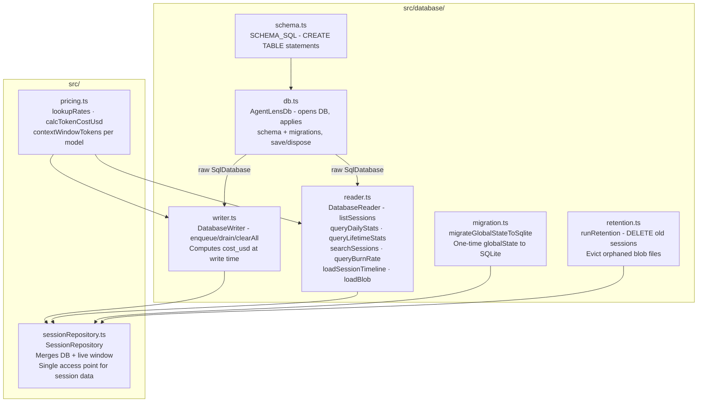
```mermaid
graph TD
    subgraph srcdb["src/database/"]
        SCH[schema.ts<br/>SCHEMA_SQL - CREATE TABLE statements]
        DBT[db.ts<br/>AgentLensDb - opens DB, applies<br/>schema + migrations, save/dispose]
        WRI[writer.ts<br/>DatabaseWriter - enqueue/drain/clearAll<br/>Computes cost_usd at write time]
        REA[reader.ts<br/>DatabaseReader - listSessions<br/>queryDailyStats · queryLifetimeStats<br/>searchSessions · queryBurnRate<br/>loadSessionTimeline · loadBlob]
        MIG[migration.ts<br/>migrateGlobalStateToSqlite<br/>One-time globalState to SQLite]
        RET[retention.ts<br/>runRetention - DELETE old sessions<br/>Evict orphaned blob files]
    end

    subgraph srcroot["src/"]
        PRI[pricing.ts<br/>lookupRates · calcTokenCostUsd<br/>contextWindowTokens per model]
        REPO[sessionRepository.ts<br/>SessionRepository<br/>Merges DB + live window<br/>Single access point for session data]
    end

    DBT -- raw SqlDatabase --> WRI
    DBT -- raw SqlDatabase --> REA
    PRI --> WRI
    PRI --> REA
    WRI --> REPO
    REA --> REPO
    SCH --> DBT
    MIG --> REPO
    RET --> REPO
```

### Data flow: write path

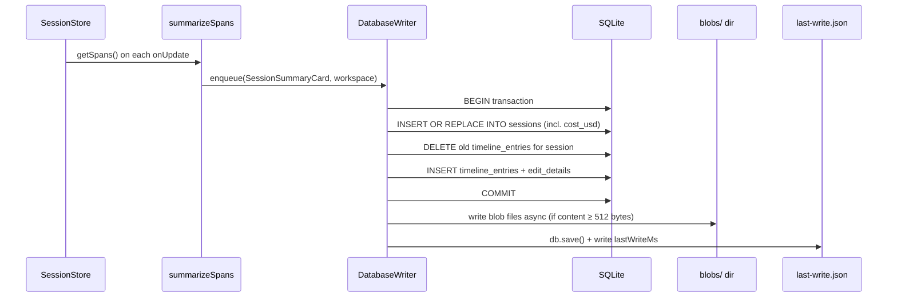
```mermaid
sequenceDiagram
    participant STO as SessionStore
    participant SUM as summarizeSpans
    participant WRI as DatabaseWriter
    participant DB as SQLite
    participant BLB as blobs/ dir
    participant SIG as last-write.json

    STO->>SUM: getSpans() on each onUpdate
    SUM->>WRI: enqueue(SessionSummaryCard, workspace)
    WRI->>DB: BEGIN transaction
    WRI->>DB: INSERT OR REPLACE INTO sessions (incl. cost_usd)
    WRI->>DB: DELETE old timeline_entries for session
    WRI->>DB: INSERT timeline_entries + edit_details
    WRI->>DB: COMMIT
    WRI->>BLB: write blob files async (if content ≥ 512 bytes)
    WRI->>SIG: db.save() + write lastWriteMs
```

### Data flow: read path

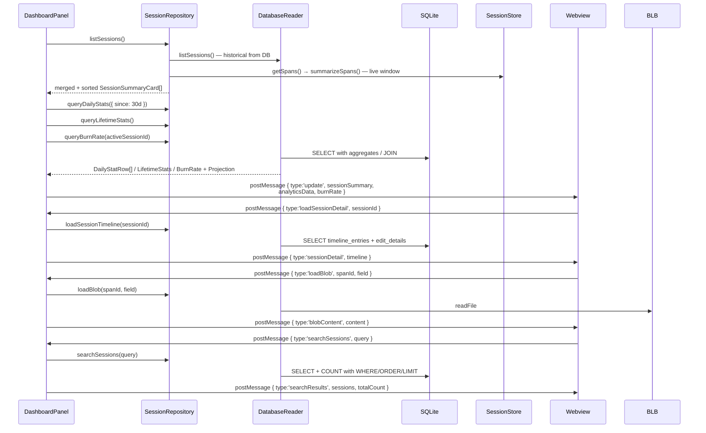
```mermaid
sequenceDiagram
    participant DASH as DashboardPanel
    participant REPO as SessionRepository
    participant REA as DatabaseReader
    participant DB as SQLite
    participant STO as SessionStore
    participant WV as Webview

    DASH->>REPO: listSessions()
    REPO->>REA: listSessions() — historical from DB
    REPO->>STO: getSpans() → summarizeSpans() — live window
    REPO-->>DASH: merged + sorted SessionSummaryCard[]

    DASH->>REPO: queryDailyStats({ since: 30d })
    DASH->>REPO: queryLifetimeStats()
    DASH->>REPO: queryBurnRate(activeSessionId)
    REA->>DB: SELECT with aggregates / JOIN
    REA-->>DASH: DailyStatRow[] / LifetimeStats / BurnRate + Projection

    DASH->>WV: postMessage { type:'update', sessionSummary,<br/>analyticsData, burnRate }

    WV->>DASH: postMessage { type:'loadSessionDetail', sessionId }
    DASH->>REPO: loadSessionTimeline(sessionId)
    REA->>DB: SELECT timeline_entries + edit_details
    DASH->>WV: postMessage { type:'sessionDetail', timeline }

    WV->>DASH: postMessage { type:'loadBlob', spanId, field }
    DASH->>REPO: loadBlob(spanId, field)
    REA->>BLB: readFile
    DASH->>WV: postMessage { type:'blobContent', content }

    WV->>DASH: postMessage { type:'searchSessions', query }
    DASH->>REPO: searchSessions(query)
    REA->>DB: SELECT + COUNT with WHERE/ORDER/LIMIT
    DASH->>WV: postMessage { type:'searchResults', sessions, totalCount }
```

### Cross-window sync

When two VS Code windows are open and one holds the OTLP collector (port 4318), the other cannot collect spans. The non-collector window polls `last-write.json` every 2 seconds and reloads a fresh DB snapshot via `openReadonlySnapshot()` when the timestamp advances.

### Storage management

`agentLens.sessionRetentionDays` (default 90) controls how long sessions are kept. `runRetention` is called at activation and every 24 hours. After deleting old rows it scans `blobs/` and removes any file whose span ID is no longer in `timeline_entries`.

`agentLens.showStorageStats` reports DB file size, blob directory size, session count, and date range to the Output channel.

---

## 9. Session Data Model

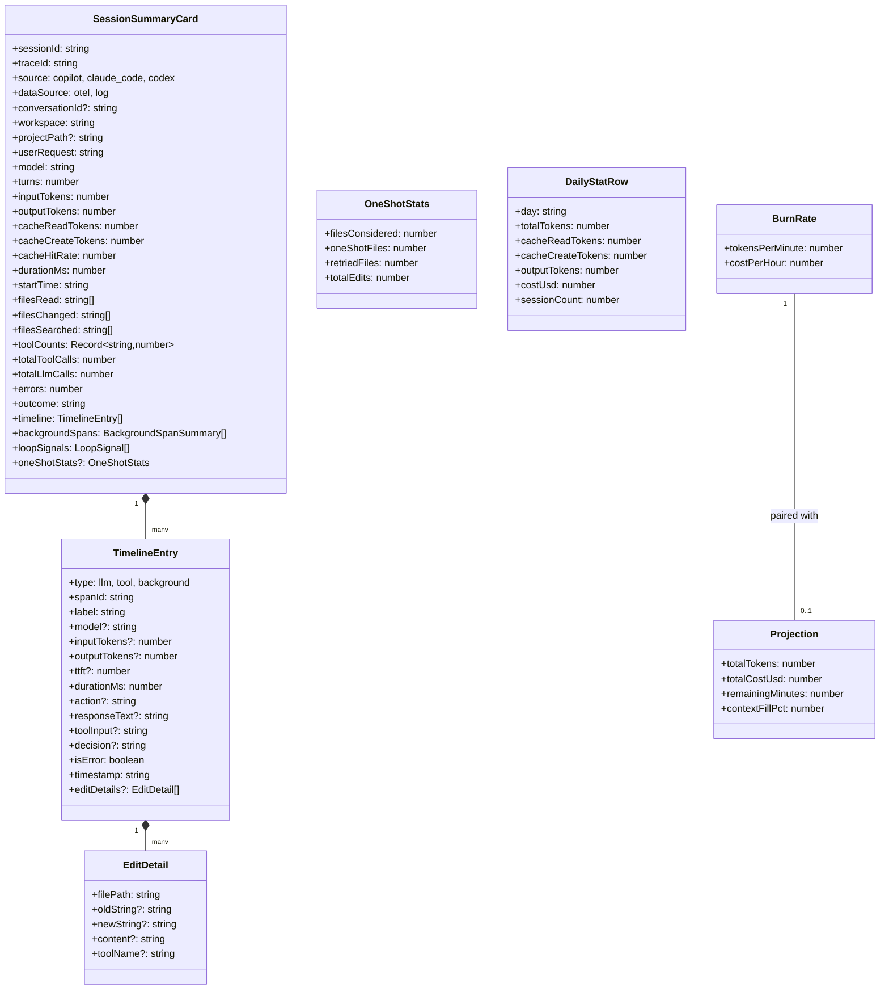
```mermaid
classDiagram
    class SessionSummaryCard {
        +sessionId: string
        +traceId: string
        +source: copilot, claude_code, codex
        +dataSource: otel, log
        +conversationId?: string
        +workspace: string
        +projectPath?: string
        +userRequest: string
        +model: string
        +turns: number
        +inputTokens: number
        +outputTokens: number
        +cacheReadTokens: number
        +cacheCreateTokens: number
        +cacheHitRate: number
        +durationMs: number
        +startTime: string
        +filesRead: string[]
        +filesChanged: string[]
        +filesSearched: string[]
        +toolCounts: Record~string,number~
        +totalToolCalls: number
        +totalLlmCalls: number
        +errors: number
        +outcome: string
        +timeline: TimelineEntry[]
        +backgroundSpans: BackgroundSpanSummary[]
        +loopSignals: LoopSignal[]
        +oneShotStats?: OneShotStats
    }

    class OneShotStats {
        +filesConsidered: number
        +oneShotFiles: number
        +retriedFiles: number
        +totalEdits: number
    }

    class TimelineEntry {
        +type: llm, tool, background
        +spanId: string
        +label: string
        +model?: string
        +inputTokens?: number
        +outputTokens?: number
        +ttft?: number
        +durationMs: number
        +action?: string
        +responseText?: string
        +toolInput?: string
        +decision?: string
        +isError: boolean
        +timestamp: string
        +editDetails?: EditDetail[]
    }

    class EditDetail {
        +filePath: string
        +oldString?: string
        +newString?: string
        +content?: string
        +toolName?: string
    }

    class DailyStatRow {
        +day: string
        +totalTokens: number
        +cacheReadTokens: number
        +cacheCreateTokens: number
        +outputTokens: number
        +costUsd: number
        +sessionCount: number
    }

    class BurnRate {
        +tokensPerMinute: number
        +costPerHour: number
    }

    class Projection {
        +totalTokens: number
        +totalCostUsd: number
        +remainingMinutes: number
        +contextFillPct: number
    }

    SessionSummaryCard "1" *-- "many" TimelineEntry
    TimelineEntry "1" *-- "many" EditDetail
    BurnRate "1" -- "0..1" Projection : paired with
```

**Lazy timeline loading:** `SessionSummaryCard.timeline` is always `[]` when read from SQLite. The webview requests individual timelines on demand via `loadSessionDetail`. Blob fields (`responseText`, `thinking`, etc.) are further deferred until the user expands an entry (`loadBlob`).

---

## 10. Frontend Architecture

The dashboard is a Preact application bundled into `media/dashboard.js`. It uses `@preact/signals` for reactive state — no Redux, no Context, no prop drilling.

### Signal graph


```mermaid
graph TD
    subgraph coredata["Core data - set by DashboardPanel"]
        SIG_SUM[sessionSummary<br/>FullSummary or null]
        SIG_TOOLS[toolCalls<br/>Record of string to number]
        SIG_TL[sessionTimelines<br/>sessionId to TimelineEntry array]
        SIG_BLOB[blobCache<br/>spanId:field to string]
        SIG_DS[dailyStats<br/>DailyStatRow array]
        SIG_LS[lifetimeStats<br/>LifetimeStats or null]
        SIG_BR[burnRateData<br/>BurnRateData or null]
        SIG_SR[searchResults<br/>SearchResultData or null]
        SIG_RSR[rangedSearchResults<br/>DB results for active time range]
    end

    subgraph uicontrols["UI controls"]
        SIG_LIM[sessionLimit<br/>number, default 10]
        SIG_AGT[selectedAgentFilter<br/>AgentFilter, default all]
        SIG_WS[workspaceFilter<br/>WorkspaceFilter, default all]
        SIG_TAB[activeTab<br/>string, default sessions]
        SIG_TF[sessionTextFilter<br/>string]
        SIG_SK[sessionSortKey<br/>start_time · total_tokens · duration_ms<br/>errors · prompt · model · source · cost]
        SIG_SD[sessionSortDir<br/>asc or desc]
        SIG_TR[timeRange<br/>preset + optional since/until]
        SIG_INF[insightFilter<br/>all · loop · efficiency]
        SIG_IGN[ignoredInsightKeys<br/>Set of string]
    end

    subgraph Computed
        COMP_AF[agentFilteredSessions<br/>computed — filter by source + workspace]
        COMP_AWS[availableWorkspaces<br/>computed — unique workspace paths]
        COMP_DISP[displaySessions<br/>computed — last N sessions]
        COMP_RS[rangedSessions<br/>computed — time range + DB merge]
        COMP_FS[filteredSessions<br/>computed — text filter + sort]
        COMP_PRES[agentPresence<br/>computed — which agents active]
    end

    SIG_SUM --> COMP_AF
    SIG_AGT --> COMP_AF
    SIG_WS --> COMP_AF
    SIG_SUM --> COMP_AWS
    COMP_AF --> COMP_DISP
    SIG_LIM --> COMP_DISP
    COMP_AF --> COMP_RS
    SIG_TR --> COMP_RS
    SIG_RSR --> COMP_RS
    COMP_RS --> COMP_FS
    SIG_TF --> COMP_FS
    SIG_SK --> COMP_FS
    SIG_SD --> COMP_FS
    COMP_RS --> COMP_PRES

    COMP_FS --> TAB_COMPS[Tab components]
    COMP_DISP --> TAB_COMPS
    SIG_TL --> TAB_COMPS
    SIG_BLOB --> TAB_COMPS
    SIG_DS --> TAB_COMPS
    SIG_LS --> TAB_COMPS
    SIG_BR --> TAB_COMPS
    SIG_SR --> TAB_COMPS
    SIG_TAB --> TAB_COMPS
```

**Key computed signal semantics:**

- `agentFilteredSessions` — all in-memory sessions filtered by agent pill, data source, and workspace dropdown. No limit applied. This is the root filter — all downstream computeds derive from it, so the workspace filter automatically scopes every tab.
- `availableWorkspaces` — sorted list of unique workspace paths from all loaded sessions. Drives the workspace dropdown options.
- `displaySessions` — `agentFilteredSessions` sliced to `sessionLimit` (most recent N). Used for the Sessions table.
- `rangedSessions` — for bounded presets (7d/30d/…): merges `rangedSearchResults` (DB) with in-memory sessions that fall in the window. For "All": returns `agentFilteredSessions` directly.
- `filteredSessions` — `rangedSessions` with text filter and sort applied. Used by Sessions table, Insights, and Efficiency charts within Analytics. Analytics charts that must stay time-ordered (ESTIMATED COST, TOKEN USAGE PER SESSION, CONTEXT GROWTH) source from `rangedSessions` directly.

**Workspace field flow:** `workspace` is stored in the `sessions` SQLite table (always present, `NOT NULL`). `project_path` is an optional secondary path some OTEL exporters populate. Both are mapped by `DatabaseReader.listSessions` into `SessionSummaryCard`. For OTEL-sourced sessions, `workspace` is stamped onto the card by `DatabaseWriter.enqueue` (the summarizers produce `workspace: ''` as a placeholder). For log-sourced sessions, `_buildCard` receives and records the workspace at parse time.

### Tab component overview

Five tabs in the sticky tab bar (Sessions, Analytics, Advisor, Export, Import), plus a Help icon button. Alerts and Automation are not tabs — they're collapsible sections inside a gear-icon slide-in Settings panel (`ConfigPanel` in `App.tsx`), alongside the OTEL/log ingestion toggles. A separate bell icon shows a live popover of currently-triggered alerts with a shortcut into the same Settings panel. Secondary views are sub-panels within the expanded session row, the Analytics layout, or the Advisor's Instructions sub-view.

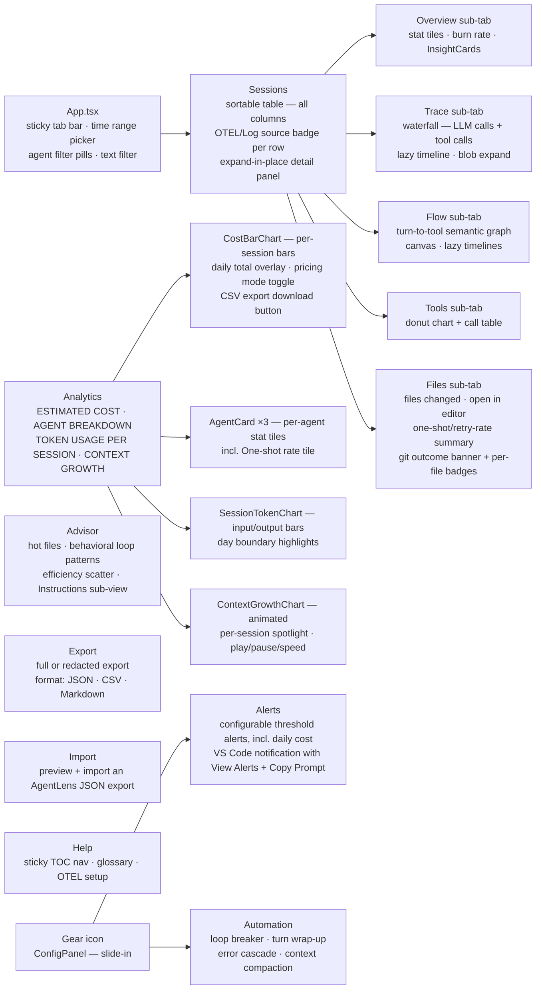
```mermaid
graph LR
    APP[App.tsx<br/>sticky tab bar · time range picker<br/>agent filter pills · text filter] --> T1

    T1[Sessions<br/>sortable table — all columns<br/>OTEL/Log source badge per row<br/>expand-in-place detail panel]
    T1 --> D1[Overview sub-tab<br/>stat tiles · burn rate · InsightCards]
    T1 --> D2[Trace sub-tab<br/>waterfall — LLM calls + tool calls<br/>lazy timeline · blob expand]
    T1 --> D3[Flow sub-tab<br/>turn-to-tool semantic graph<br/>canvas · lazy timelines]
    T1 --> D4[Tools sub-tab<br/>donut chart + call table]
    T1 --> D5[Files sub-tab<br/>files changed · open in editor<br/>one-shot/retry-rate summary<br/>git outcome banner + per-file badges]

    T2[Analytics<br/>ESTIMATED COST · AGENT BREAKDOWN<br/>TOKEN USAGE PER SESSION · CONTEXT GROWTH]
    T2 --> A1[CostBarChart — per-session bars<br/>daily total overlay · pricing mode toggle<br/>CSV export download button]
    T2 --> A2[AgentCard ×3 — per-agent stat tiles<br/>incl. One-shot rate tile]
    T2 --> A3[SessionTokenChart — input/output bars<br/>day boundary highlights]
    T2 --> A4[ContextGrowthChart — animated<br/>per-session spotlight · play/pause/speed]

    T3[Advisor<br/>hot files · behavioral loop patterns<br/>efficiency scatter · Instructions sub-view]
    T4[Export<br/>full or redacted export<br/>format: JSON · CSV · Markdown]
    T5[Import<br/>preview + import an AgentLens JSON export]
    T6[Help<br/>sticky TOC nav · glossary · OTEL setup]

    GEAR[Gear icon<br/>ConfigPanel — slide-in] --> S1[Alerts<br/>configurable threshold alerts, incl. daily cost<br/>VS Code notification with View Alerts + Copy Prompt]
    GEAR --> S2[Automation<br/>loop breaker · turn wrap-up<br/>error cascade · context compaction]
```

**Chart data isolation:** Analytics charts (`CostBarChart`, `SessionTokenChart`, `ContextGrowthChart`) source from `rangedSessions` (always newest-first by time) so the Sessions table sort key has no effect on their order.

### DashboardPanel ↔ Webview message protocol

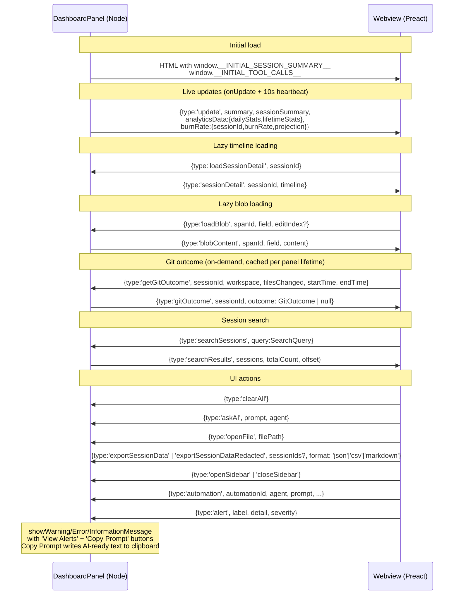
```mermaid
sequenceDiagram
    participant EXT as DashboardPanel (Node)
    participant WV  as Webview (Preact)

    Note over EXT,WV: Initial load
    EXT->>WV: HTML with window.__INITIAL_SESSION_SUMMARY__<br/>window.__INITIAL_TOOL_CALLS__

    Note over EXT,WV: Live updates (onUpdate + 10s heartbeat)
    EXT->>WV: {type:'update', summary, sessionSummary,<br/>analyticsData:{dailyStats,lifetimeStats},<br/>burnRate:{sessionId,burnRate,projection}}

    Note over EXT,WV: Lazy timeline loading
    WV->>EXT: {type:'loadSessionDetail', sessionId}
    EXT->>WV: {type:'sessionDetail', sessionId, timeline}

    Note over EXT,WV: Lazy blob loading
    WV->>EXT: {type:'loadBlob', spanId, field, editIndex?}
    EXT->>WV: {type:'blobContent', spanId, field, content}

    Note over EXT,WV: Git outcome (on-demand, cached per panel lifetime)
    WV->>EXT: {type:'getGitOutcome', sessionId, workspace, filesChanged, startTime, endTime}
    EXT->>WV: {type:'gitOutcome', sessionId, outcome: GitOutcome | null}

    Note over EXT,WV: Session search
    WV->>EXT: {type:'searchSessions', query:SearchQuery}
    EXT->>WV: {type:'searchResults', sessions, totalCount, offset}

    Note over EXT,WV: UI actions
    WV->>EXT: {type:'clearAll'}
    WV->>EXT: {type:'askAI', prompt, agent}
    WV->>EXT: {type:'openFile', filePath}
    WV->>EXT: {type:'exportSessionData' | 'exportSessionDataRedacted', sessionIds?, format: 'json'|'csv'|'markdown'}
    WV->>EXT: {type:'openSidebar' | 'closeSidebar'}
    WV->>EXT: {type:'automation', automationId, agent, prompt, ...}
    WV->>EXT: {type:'alert', label, detail, severity}
    Note over EXT: showWarning/Error/InformationMessage<br/>with 'View Alerts' + 'Copy Prompt' buttons<br/>Copy Prompt writes AI-ready text to clipboard
```

---

## 11. Cost Calculation

Cost is computed in two places:

1. **Extension host** (`src/pricing.ts`) — at write time; `cost_usd` is stored in the `sessions` row and used for all aggregate queries (`SUM(cost_usd)`, `queryDailyStats`, `queryBurnRate`).
2. **Browser** (`media/src/pricing.ts`) — at display time; per-turn cost shown in the Cost tab and Flow tooltip. The two rate tables are kept in sync manually.

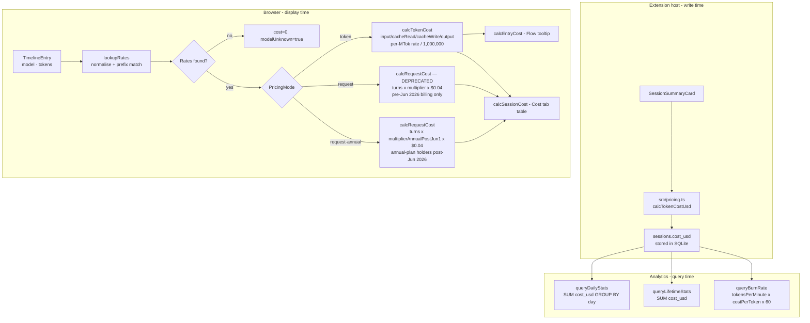
```mermaid
flowchart TD
    subgraph exthost["Extension host - write time"]
        CARD[SessionSummaryCard] --> PRI_EXT[src/pricing.ts<br/>calcTokenCostUsd]
        PRI_EXT --> DB_COST[sessions.cost_usd<br/>stored in SQLite]
    end

    subgraph browser["Browser - display time"]
        ENTRY[TimelineEntry<br/>model · tokens] --> LR[lookupRates<br/>normalise + prefix match]
        LR --> RATES{Rates found?}
        RATES -- no  --> ZERO[cost=0, modelUnknown=true]
        RATES -- yes --> MODE{PricingMode}
        MODE -- token --> TC[calcTokenCost<br/>input/cacheRead/cacheWrite/output<br/>per-MTok rate / 1,000,000]
        MODE -- request-annual --> RA[calcRequestCost<br/>turns x multiplierAnnualPostJun1 x $0.04<br/>annual-plan holders post-Jun 2026]
        MODE -- request --> RC[calcRequestCost — DEPRECATED<br/>turns x multiplier x $0.04<br/>pre-Jun 2026 billing only]
        TC --> ENTRY_COST[calcEntryCost - Flow tooltip]
        TC --> SESS_COST[calcSessionCost - Cost tab table]
        RC --> SESS_COST
        RA --> SESS_COST
    end

    subgraph analytics["Analytics - query time"]
        DB_COST --> AGG[queryDailyStats<br/>SUM cost_usd GROUP BY day]
        DB_COST --> LIFE[queryLifetimeStats<br/>SUM cost_usd]
        DB_COST --> BURN[queryBurnRate<br/>tokensPerMinute x costPerToken x 60]
    end
```

`contextWindowTokens` (stored in `src/pricing.ts`) enables the `Projection` calculation: given current session token usage and burn rate, estimate time to context exhaustion and final cost.

Pricing data covers: OpenAI (GPT-4.1 through GPT-5.6), Anthropic (Claude Haiku 3.5/4.5, Sonnet 4.x/5, Opus 4.x/5, Fable 5/5.1, Mythos 5/5.1), Google (Gemini 2.5–3.7), Codex, third-party Copilot-marketplace models (Grok, Kimi, MAI-Code), OpenCode Zen free models, and fine-tuned models. Some models also carry a per-model tiered "long context" surcharge above a token-per-call threshold — see `PRICING_SOURCES.md`. Refreshed per the runbook in `PRICING_SOURCES.md`. Last updated: 2026-09-01.

---

## 12. Auto-Configuration

When the extension activates it attempts to configure each agent automatically.

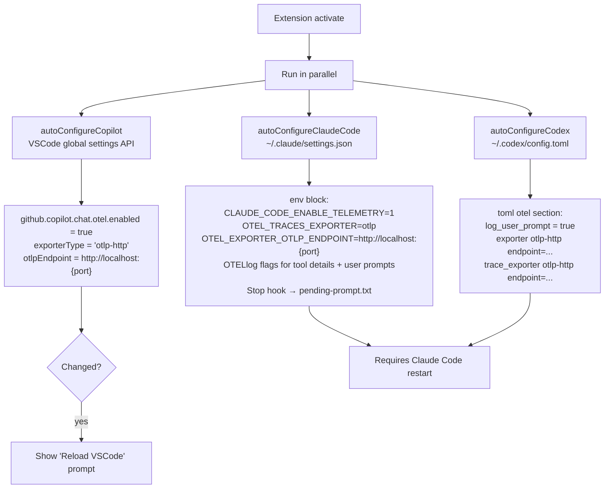
```mermaid
flowchart TD
    ACT[Extension activate] --> PAR[Run in parallel]

    PAR --> CP_CFG[autoConfigureCopilot<br/>VSCode global settings API]
    PAR --> CC_CFG[autoConfigureClaudeCode<br/>~/.claude/settings.json]
    PAR --> CX_CFG[autoConfigureCodex<br/>~/.codex/config.toml]

    CP_CFG --> CP_KEYS["github.copilot.chat.otel.enabled = true<br/>exporterType = 'otlp-http'<br/>otlpEndpoint = http://localhost:{port}"]
    CP_KEYS --> CP_OUT{Changed?}
    CP_OUT -- yes --> RELOAD[Show 'Reload VSCode' prompt]

    CC_CFG --> CC_KEYS["env block:<br/>CLAUDE_CODE_ENABLE_TELEMETRY=1<br/>OTEL_TRACES_EXPORTER=otlp<br/>OTEL_EXPORTER_OTLP_ENDPOINT=http://localhost:{port}<br/>OTELlog flags for tool details + user prompts<br/><br/>Stop hook → pending-prompt.txt"]

    CX_CFG --> CX_KEYS["toml otel section:<br/>log_user_prompt = true<br/>exporter otlp-http endpoint=...<br/>trace_exporter otlp-http endpoint=..."]

    CC_KEYS --> RESTART[Requires Claude Code restart]
    CX_KEYS --> RESTART
```

---

## 13. Background Service Mode

Standalone-mode only (`agentlens service <cmd>`, dispatched from `standalone/cli.ts` before the
normal server bootstrap). Lets the server outlive a closed terminal, sleep, or reboot — otherwise
incoming OTEL data has nowhere to go while nothing is listening, and agents don't queue or retry
failed exports, so the gap is permanent. Not applicable to the VS Code extension, which is already
kept running by the IDE itself.

`src/serviceConfig.ts` holds all the pure logic (config read/write, flag parsing, npx detection,
and the three service-definition generators) so it's unit-tested without shelling out to a real
OS service manager. `standalone/service/{macos,linux,windows}.ts` each pair that pure output with
the actual `fs`/`child_process` calls for their platform.


```mermaid
flowchart TD
    CLI["agentlens service install<br/>(standalone/cli.ts)"] --> NPX{Running via npx?}

    NPX -- yes --> BOOT["npm install -g agentlens-dashboard@latest<br/>(visible, not silent)"]
    BOOT --> REEXEC[Re-invoke as the now-globally-linked<br/>`agentlens service install`]
    REEXEC --> DISPATCH

    NPX -- no --> DISPATCH{os.platform&#40;&#41;}

    DISPATCH -- darwin --> MAC["launchd LaunchAgent<br/>~/Library/LaunchAgents/com.agentlens.server.plist<br/>RunAtLoad + KeepAlive"]
    DISPATCH -- linux --> LIN["systemd --user unit<br/>~/.config/systemd/user/agentlens.service<br/>enable --now"]
    DISPATCH -- win32 --> WIN["Scheduled Task at logon<br/>+ generated run.cmd wrapper<br/>(env vars set per-task, not persisted globally)"]

    MAC & LIN & WIN --> CFG[Write ~/.agentlens/config.json<br/>ports · bindHost · dataDir]
    CFG --> LOG[All 3 platforms redirect stdout/stderr<br/>to dataDir/logs/service.log]

    STATUS["agentlens service status"] --> PROBE["HTTP GET http://bindHost:uiPort/<br/>(same convention as the Dockerfile HEALTHCHECK)"]

    UPDATE["agentlens service update"] --> NPMLATEST["npm install -g agentlens-dashboard@latest"]
    NPMLATEST --> RESTART["platformService.restart&#40;&#41;<br/>(re-execs whatever now sits at the same install path)"]
```

A global install pins a version — and so does `npx` in practice: a bare `npx agentlens-dashboard`
re-runs whatever npx cached without revalidating against the registry, so only `npx …@latest`
reliably resolves the newest release (the user-facing docs say `@latest` everywhere for this
reason). Either way a service definition points at a fixed on-disk path that only changes when
something overwrites it. `update` is that
"something": it shells out to `npm install -g agentlens-dashboard@latest` (overwriting the files at
the path already baked into the service definition) and then restarts, so no service definition
rewrite is needed. `standalone/service/index.ts`'s `readGlobalVersion()` reads the installed
package's `package.json` before and after so the command can report what actually changed (or that
it was already current).

`standalone/server.ts` reads `~/.agentlens/config.json` at startup as a fallback underneath the
existing `OTLP_PORT`/`UI_PORT`/`MCP_PORT`/`BIND_HOST`/`DATA_DIR` env vars (env var still wins if
set), so an ad-hoc `npx`/`node standalone/server.js` run and a service install share one config
story instead of diverging.

`uninstall` removes the service definition only — it never touches `~/.agentlens`'s data or
config, matching the same separation the extension's Clear-All-Data command already keeps between
"stop this from running" and "delete my data."

---

## 14. Build Pipeline

Five independent esbuild targets produce five output bundles.

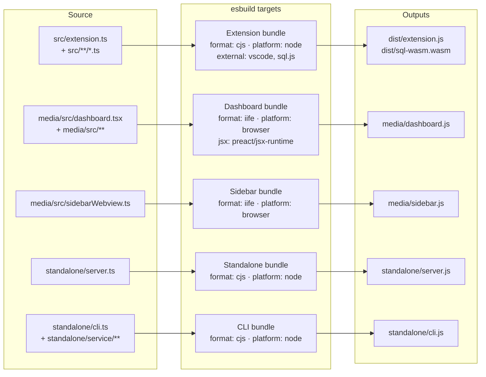
```mermaid
graph LR
    subgraph Source
        SRC_EXT[src/extension.ts<br/>+ src/**/*.ts]
        SRC_DASH[media/src/dashboard.tsx<br/>+ media/src/**]
        SRC_SB[media/src/sidebarWebview.ts]
        SRC_SA[standalone/server.ts]
        SRC_CLI[standalone/cli.ts<br/>+ standalone/service/**]
    end

    subgraph esbuild targets
        B1[Extension bundle<br/>format: cjs · platform: node<br/>external: vscode, sql.js]
        B2[Dashboard bundle<br/>format: iife · platform: browser<br/>jsx: preact/jsx-runtime]
        B3[Sidebar bundle<br/>format: iife · platform: browser]
        B4[Standalone bundle<br/>format: cjs · platform: node]
        B5[CLI bundle<br/>format: cjs · platform: node]
    end

    subgraph Outputs
        O1[dist/extension.js<br/>dist/sql-wasm.wasm]
        O2[media/dashboard.js]
        O3[media/sidebar.js]
        O4[standalone/server.js]
        O5[standalone/cli.js]
    end

    SRC_EXT --> B1 --> O1
    SRC_DASH --> B2 --> O2
    SRC_SB --> B3 --> O3
    SRC_SA --> B4 --> O4
    SRC_CLI --> B5 --> O5
```

`sql.js` is loaded dynamically at runtime (not bundled) to keep the extension bundle small. The WASM binary is copied to `dist/sql-wasm.wasm` during the build and located via `extensionUri` at activation.

`standalone/cli.js` dynamically imports either `standalone/server.js`'s source or
`standalone/service/index.ts` at runtime depending on the `service` subcommand check — esbuild
bundles both paths into the one output file regardless, so there's no separate service-only
bundle to keep track of.

### Type-check vs bundle

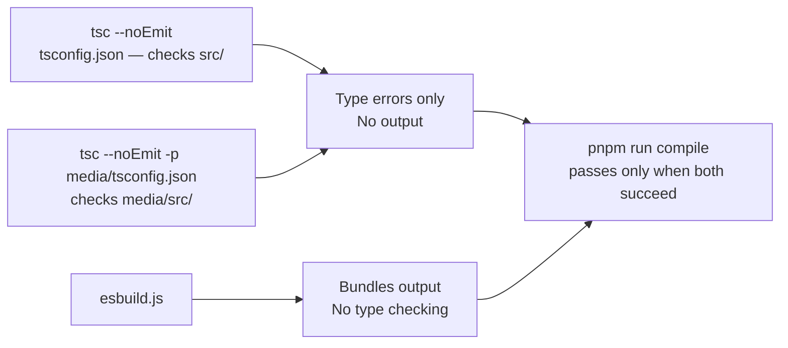
```mermaid
graph LR
    TSC1["tsc --noEmit<br/>tsconfig.json — checks src/"] --> TC_ONLY[Type errors only<br/>No output]
    TSC2["tsc --noEmit -p media/tsconfig.json<br/>checks media/src/"] --> TC_ONLY
    ESB[esbuild.js] --> BUNDLES[Bundles output<br/>No type checking]
    TC_ONLY & BUNDLES --> CI["pnpm run compile<br/>passes only when both succeed"]
```

`standalone/tsconfig.json` covers `standalone/**` (including `cli.ts` and `service/**`) for
editor IntelliSense and can be run manually via `tsc -p standalone/tsconfig.json --noEmit` — it
isn't currently wired into `pnpm run compile`/`check-types`, so a `standalone`-only type error
won't fail CI today. Pre-existing gap, not introduced by the background-service feature, but
worth knowing about since it's the one part of the codebase `check-types` doesn't actually cover.

---

## 15. AgentLens Pro — team link

Everything in `src/team/` is the **client half of AgentLens Pro** — an optional layer that lets a
lead see cross-developer aggregates. It is built against two rules:

1. **Privacy is a property, not a promise.** An unlinked install makes *no* request to any
   AgentLens service — no version ping, no "do you have a team" check. `getTeamStatus()` and
   `loadCredentials()` touch local disk only. The wire format (AL 02) has no free-text field, so
   there is nothing for source code to travel in.
2. **The free/paid line is single-player vs. multiplayer.** Everything about *my machine, my
   commits, my repositories* is free and ungimped. Paid is *everyone's* — aggregation a local
   install genuinely cannot do. Nothing local is gated behind Pro.

### Module map

| Module | Responsibility |
|---|---|
| `src/team/config.ts` | The one list of every URL the client can contact; `TeamCredentials` shape |
| `src/team/pkce.ts` | OAuth 2.0 PKCE (RFC 7636) + CSRF-state crypto — pure, no I/O |
| `src/team/callbackServer.ts` | One-shot `127.0.0.1:0` loopback listener for the redirect; cannot outlive the attempt |
| `src/team/credentials.ts` | `~/.agentlens/team.json`, mode 0600, keychain-ready via `CredentialStore` |
| `src/team/oauthClient.ts` | Token exchange / refresh / revoke, device flow, roster self-lookup |
| `src/team/link.ts` | `linkInteractive` (PKCE), `linkViaDevice` (RFC 8628), `leave` (local-first) |
| `src/team/status.ts` | `getTeamStatus()` — local-only status for the panel, dot and CLI |
| `src/team/privacy.ts` | `SENT` / `NEVER_SENT` — the payload promise, pinned by a test, mirrored on the consent screen |
| `src/team/panelController.ts` | Transport-agnostic handler for `team*` webview messages |
| `src/forward/schema.ts` | The wire format as hand-written types + enum maps; **never imports `SessionSummaryCard`** |
| `src/forward/repoKey.ts` | HKDF/HMAC repository-key derivation from the local clone's root commit |
| `src/forward/buildSessionRollup.ts` | `SessionRollup` builder — explicit field-by-field, no spread, hashing done here |
| `src/forward/buildCommitRecords.ts` / `buildTurnoverSamples.ts` | Wire mappers for AL 05 / AL 06 domain data |
| `src/forward/jsonSchemaValidate.ts` / `validate.ts` | Client-side validation against the committed schema (no `ajv` dependency) |
| `src/team/payloadPreview.ts` | Card → `--explain-payload` text, for the panel's "Show the exact payload" |
| `schema/rollup.v1.json` | JSON Schema form of the wire format — committed, shipped, and served by the service |

`agentlens --explain-payload [--last|--all|--session <id>|--since <date>]` and `--dry-run`
(`standalone/explainPayload.ts`) print the exact bytes for a real session, stable-key-ordered,
on a free install with no team. A test asserts the printed JSON equals the queued JSON (AL 04).

The wire contract (AL 02) is owned **here**, in the client the sceptic already trusts, and the
service validates against the identical document. `src/forward/` is a closed island: every field
is a number, an enum, a hash or a timestamp, and a CI test walks `schema/rollup.v1.json` to fail
the build if any string is left unconstrained. See [`docs/wire-schema.md`](docs/wire-schema.md).
`install_id` lives in `~/.agentlens/config.json` (`src/serviceConfig.ts` `ensureInstallId`) and
is **not** in the payload — the service derives identity from the bearer token.

### Surfaces

- **Team panel** (`media/src/panels/TeamPanel.tsx`) — a slide-in beside Settings, opened from a
  new tab-bar icon carrying a state dot (grey unlinked / green reporting / amber queued or
  degraded). The unlinked state is what almost every install shows forever; it states plainly
  that nothing is sent and offers `Show the exact payload` *before* linking.
- **CLI** — `agentlens team <link|status|leave> [--device]` (`standalone/team-cli.ts`).
- **Command palette** — `AgentLens: Link This Machine to a Team`, `… Team Link Status`,
  `… Leave Team`.
- **Standalone server** — `GET/POST /api/team`, dispatched through the same `panelController`.

### Leaving

`leave()` deletes the local credential and stops forwarding **before** it attempts the
server-side revoke. A developer who decides to leave while offline still leaves. This is a
design requirement, not a courtesy.

---

## File Map

```text
agentlens/
├── src/
│   ├── extension.ts              # Activation, commands, panels, status bar, retention
│   ├── otlpCollector.ts          # HTTP server, Codex session synthesis
│   ├── otlpParser.ts             # Pure parsing (tests/standalone)
│   ├── sessionStore.ts           # 5-min rolling span window, onUpdate callbacks
│   ├── spanStore.ts              # Standalone server's persisted span cap (pruneSpans, safe load/save)
│   ├── sessionRepository.ts      # Merges DB + live window; single session data access point
│   ├── spanSummarizer.ts         # Orchestrates per-agent builders
│   ├── pricing.ts                # Extension-host pricing: lookupRates, calcTokenCostUsd
│   ├── sidebarPanel.ts           # Sidebar webview
│   ├── dashboardPanel.ts         # Full dashboard webview, message protocol, alert notifications
│   ├── mcpServer.ts              # MCP server — exposes session history to Claude Code / MCP clients
│   ├── autoConfig.ts             # Copilot VS Code settings
│   ├── autoConfigNode.ts         # Claude/Codex file-based config
│   ├── vscodeFamilyIdes.ts       # App-directory names for VS Code-family IDEs (Copilot Chat log discovery)
│   ├── exportData.ts             # JSON export helpers
│   ├── exportFormats.ts          # CSV + Markdown export serialization
│   ├── gitOutcome.ts             # On-demand git-outcome classification (reverted/productive/abandoned/ambiguous)
│   ├── oneShotRate.ts            # One-shot / retry-rate metric — per-file edit-count aggregation
│   ├── logReader.ts              # LogReader — local log ingestion (Claude/Codex/Copilot CLI/Copilot Chat JSONL+JSON/OpenCode SQLite)
│   ├── loopDetector.ts           # Loop signal detection; shares getFileEditCounts with oneShotRate.ts
│   ├── instructionAdvisor.ts     # Advisor tab analysis — hot files, loop patterns, high turn counts
│   ├── instructionEffectiveness.ts # Before/after baseline metrics for applied instruction suggestions
│   ├── instructionFiles.ts       # Detects/reads/writes CLAUDE.md, copilot-instructions.md, AGENTS.md
│   ├── serviceConfig.ts          # Background-service config file + launchd/systemd/Windows-task generators (pure, tested)
│   ├── types.ts                  # Shared extension-host types
│   ├── database/
│   │   ├── schema.ts             # SCHEMA_SQL — CREATE TABLE statements + indexes
│   │   ├── db.ts                 # AgentLensDb — open, migrate, save, dispose
│   │   ├── writer.ts             # DatabaseWriter — enqueue/drain, blob writes, cost_usd, one_shot_stats
│   │   ├── reader.ts             # DatabaseReader — list, search, analytics, burn rate, blobs
│   │   ├── migration.ts          # migrateGlobalStateToSqlite (one-time)
│   │   ├── retention.ts          # runRetention — DELETE old sessions + blob eviction
│   │   ├── instructionRepository.ts # Applied/dismissed instruction-suggestion records
│   │   └── types.ts              # Shared DB types
│   ├── summarizers/
│   │   ├── claude.ts             # Claude Code session builder
│   │   ├── copilot.ts            # Copilot session builder
│   │   ├── codex.ts              # Codex session builder
│   │   ├── helpers.ts            # Shared attribute/token extraction
│   │   └── summarizerTypes.ts    # SessionSummaryCard, TimelineEntry, etc.
│   └── test/
│       ├── sessionStore.test.ts
│       ├── spanStore.test.ts
│       ├── spanSummarizer.test.ts
│       ├── otlpCollector.test.ts
│       ├── otlpParser.test.ts
│       ├── loopDetector.test.ts
│       ├── logReader.opencode.test.ts
│       ├── gitOutcome.test.ts
│       ├── oneShotRate.test.ts
│       ├── exportFormats.test.ts
│       ├── serviceConfig.test.ts
│       ├── extension.test.ts
│       ├── database/
│       │   ├── writer.test.ts
│       │   ├── reader.test.ts
│       │   ├── reader.analytics.test.ts
│       │   ├── migration.test.ts
│       │   ├── retention.test.ts
│       │   └── sessionRepository.test.ts
│       └── pricing.test.ts
├── media/
│   ├── src/
│   │   ├── dashboard.tsx         # Entry point — mounts App into the webview DOM
│   │   ├── App.tsx               # Preact root, message handler, tab router, sticky tab bar,<br/>bell icon (Alerts popover) + gear icon (ConfigPanel: Alerts · Automation)
│   │   ├── state.ts              # Signals: sessions, timelines, blobs, analytics, sort, time range, gitOutcomes
│   │   ├── types.ts              # Frontend types mirroring backend + analytics types
│   │   ├── pricing.ts            # Browser pricing: rate table, lookupRates, calcTokenCost
│   │   ├── sessionMetrics.ts     # calcSessionCost, calcEntryCost, fmtUsd, buildDailyCostMap, getDailyCostUsd
│   │   ├── utils.ts              # Formatting helpers, agent colors, session labels
│   │   ├── agentProfiles.ts      # Per-agent alert/automation thresholds incl. daily cost (localStorage)
│   │   ├── AgentThresholdInputs.tsx  # Reusable form input components for threshold editing
│   │   ├── sidebarWebview.ts     # Sidebar JS (no JSX)
│   │   ├── styles/
│   │   │   ├── base.css          # Global variables, layout primitives
│   │   │   ├── tabs.css          # Tab bar (sticky), tab-mini buttons
│   │   │   ├── toolbar.css       # Time range picker, agent filter pills, search bar
│   │   │   ├── components.css    # Cards, tables, tool-insights-table, empty states
│   │   │   ├── tooltip.css       # has-metric-tip, metric-tooltip (global hover tooltip)
│   │   │   ├── waterfall.css     # Trace waterfall timeline
│   │   │   ├── summaries.css     # Session detail expand: sw-detail, sw-bg-* blocks
│   │   │   ├── heatmap.css       # heatmap-axis-label used by Cost/Efficiency charts
│   │   │   ├── insights.css      # InsightCard styles
│   │   │   ├── graph.css         # Flow semantic graph canvas overlay
│   │   │   ├── help.css          # Help tab typography, TOC nav, glossary
│   │   │   └── export.css        # Export tab card layout
│   │   └── tabs/
│   │       ├── Sessions.tsx      # Sortable session table, expand-in-place detail panel
│   │       │                     #   sub-tabs: Overview (InsightCards) · Trace · Flow · Tools ·
│   │       │                     #   Files (one-shot/retry-rate summary + git outcome banner/badges)
│   │       ├── Analytics.tsx     # ESTIMATED COST · AGENT BREAKDOWN (incl. one-shot rate) · TOKEN USAGE · CONTEXT GROWTH
│   │       ├── Insights.tsx      # InsightCard component + generateInsights; clipboard copy icon
│   │       ├── Cost.tsx          # CostBarChart (canvas), per-session cost table, M/K token toggle, CSV export, fmtUsd
│   │       ├── SessionCharts.tsx # ContextGrowthChart (animated), SessionTokenChart, TurnsLink
│   │       ├── Traces.tsx        # Waterfall rows (Step/StepRow), background span groups
│   │       ├── Flow.tsx          # Turn-to-tool semantic graph (canvas), FlowCanvas component
│   │       ├── Agents.tsx        # computeStats helper used by Analytics AgentCard
│   │       ├── Tools.tsx         # ToolsChart (donut + table) used by Sessions detail
│   │       ├── Patterns.tsx      # Advisor tab — hot files, loop patterns, efficiency scatter, Instructions sub-view
│   │       ├── Instructions.tsx  # Instruction-file suggestion cards (apply/dismiss) used by Patterns
│   │       ├── Import.tsx        # Import tab — preview + import an AgentLens JSON export
│   │       ├── Alerts.tsx        # Alert config UI (incl. daily cost threshold), checkAlerts, AlertNotification type
│   │       ├── Automation.tsx    # Automation config UI, checkAutomations, prompt building
│   │       ├── Settings.tsx      # OTEL/log ingestion toggles, MCP toggle, reconfigure button (in gear-icon ConfigPanel)
│   │       ├── IngestionNote.tsx # Shared OTEL-vs-log-richness callout used by Help/Settings
│   │       ├── Export.tsx        # Full or redacted export UI — format: JSON · CSV · Markdown
│   │       └── Help.tsx          # Sticky TOC nav, glossary, OTEL setup guide
│   ├── dashboard.js              # Compiled Preact bundle
│   ├── dashboard.css             # Compiled styles
│   └── sidebar.js                # Compiled sidebar script
├── standalone/
│   ├── server.ts                 # Standalone HTTP server (no VS Code)
│   ├── cli.ts                    # npx entrypoint: `agentlens` / `agentlens-dashboard` — dispatches to
│   │                              #   `service` subcommand or starts the server directly
│   └── service/
│       ├── index.ts              # `agentlens service <cmd>` dispatch, npx-bootstrap, logs/status
│       ├── health.ts             # HTTP probe used by `service status` on all 3 platforms
│       ├── macos.ts              # launchd install/uninstall/start/stop/restart
│       ├── linux.ts              # systemd --user install/uninstall/start/stop/restart
│       └── windows.ts            # Scheduled Task install/uninstall/start/stop/restart
├── esbuild.js                    # Build configuration (5 targets)
├── package.json                  # VS Code manifest + scripts
└── ARCHITECTURE.md               # This file
```
