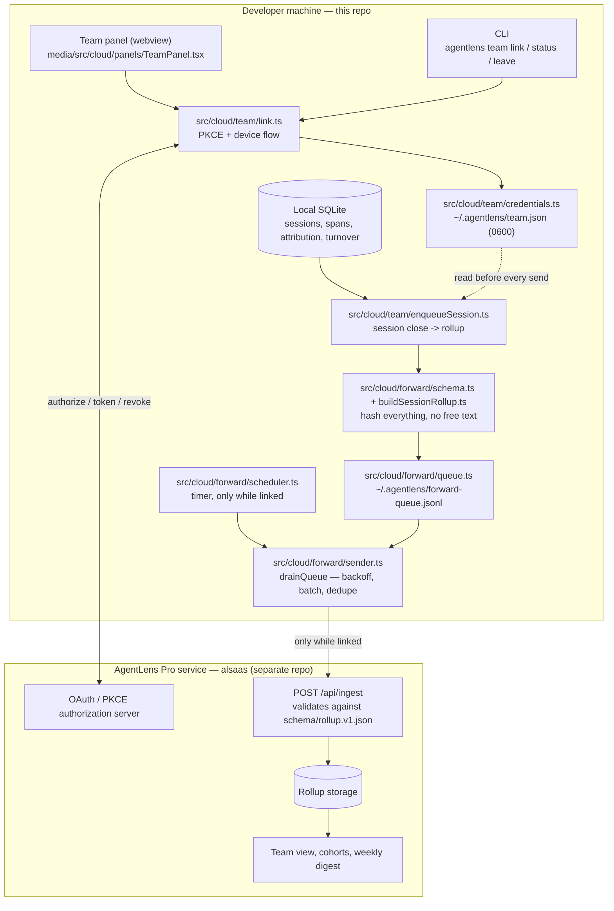

# AgentLens Pro — Cloud Architecture

This is the entry point for the **cloud / team** feature set merged onto this branch from the
`pro/01`–`pro/09` series (`AL 01`–`AL 09` in the plan below). It indexes the deep-dive docs that
already exist rather than repeating them, and adds the diagrams none of them have yet.

**Start here, then go deep:**

| Doc | Covers |
| --- | --- |
| [CLOUD_FEATURES.md](CLOUD_FEATURES.md) | What each merged slice actually does, feature by feature |
| [ARCHITECTURE.md §15](ARCHITECTURE.md#15-agentlens-pro--team-link) | The full module map, every file, the free/paid boundary, the outcome-metric engines |
| [`src/cloud/README.md`](src/cloud/README.md) | Why this code lives in one directory, and under a different license |
| [`NOTICE.md`](NOTICE.md) | The exact license split for this repository |
| [`docs/wire-schema.md`](docs/wire-schema.md) | The exact wire contract, and how to verify the privacy claim yourself |
| [`docs/pricing-boundary.md`](docs/pricing-boundary.md) | The free/paid line, word-for-word with the pricing page |
| [`.staged-feature/README.md`](.staged-feature/README.md) | The phased plan this was built against, and the companion closed-source service repo (`alsaas`) |
| `.staged-feature/01`–`09` | The design doc for each merged slice — privacy invariants and tier called out per plan |

## The two rules everything below answers to

1. **Privacy is a property, not a promise.** An unlinked install makes no request to any
   AgentLens service, ever. The wire format has no free-text field — there is nothing for source
   code to travel in even if a bug tried to send it.
2. **The free/paid line is single-player vs. multiplayer.** Everything about *my* machine, *my*
   commits, *my* repositories is free and complete. Paid is cross-developer aggregation — the one
   thing a local install genuinely cannot do itself. Nothing local is gated behind Pro.

## Two repositories, one contract

The team feature spans two codebases. This repo owns the wire schema; the hosted service
(`alsaas`, closed-source, not in this checkout) only validates against it — never the reverse,
because the claim *"this client cannot send your code"* is only worth what it's worth in the
repository a skeptical developer already trusts.

**Reading the diagram:** everything left of the repo boundary ships in this npm package / VSIX
and is inspectable by anyone. Nothing crosses to the right unless `credentials.ts` has a saved
credential — `ENQ`, `SCHED`, and `SEND` all check that first and return before touching disk or
network otherwise. `--explain-payload` (`standalone/cloud/explainPayload.ts`) prints exactly what
`SCHEMA` would build for a real session, so the claim above is checkable without a team at all.

## The free tier: fully local, no such diagram needed for privacy — but here's the pipeline

`src/cloud/attribution/` and `src/cloud/turnover/` have no network path in their dependency graph at all —
not gated, not disabled, structurally absent. This is the engine behind the **Outcomes** tab and
is free forever.

```mermaid
graph LR
    GIT[("git log --numstat<br/>git blame --line-porcelain")] --> SCAN["attribution/commitScan.ts"]
    SCAN --> JOIN["attribution/sessionJoin.ts<br/>match commits to local sessions"]
    JOIN --> BLAME["attribution/blame.ts"]
    BLAME --> ATTR["attribution/index.ts<br/>attributeRepository()"]
    ATTR --> ADB[("attributionRepository<br/>SQLite cache")]
    ADB --> COH["turnover/cohorts.ts<br/>monthly cohorts"]
    COH --> SURV["turnover/survival.ts<br/>surviving-AI-lines estimate"]
    SURV --> COMP["turnover/index.ts<br/>computeTurnover()"]
    COMP --> TDB[("turnoverRepository<br/>one row per repo")]
    TDB --> REPORT["turnover/localReport.ts"]
    REPORT --> TAB["Outcomes tab<br/>media/src/cloud/tabs/Outcomes.tsx"]
```

`computeTurnover()` returns `TurnoverResult | InsufficientData` — never a bare percentage without
a line/commit count and date range attached, and a cohort is only measured once its window has
fully elapsed (`measurableAt` / `isWindowElapsed`). Confidence per commit is **certain** (agent
trailer, or the commit lands inside a session's own span), **probable** (session lists the file,
commit within a 72h lookback), or **unknown** — most commits on a real repo, and excluded from
the denominator rather than guessed at.

## What ships where

| Surface | Entry point | Notes |
| --- | --- | --- |
| VS Code command palette | `AgentLens: Link This Machine to a Team` / `… Team Link Status` / `… Leave Team` | `registerTeamCommands` in `src/extension.ts` |
| VS Code webview | Team panel, a slide-in beside Settings | `media/src/cloud/panels/TeamPanel.tsx` + `src/cloud/team/panelController.ts` |
| Dashboard tab (free) | **Outcomes** | `media/src/cloud/tabs/Outcomes.tsx`; opens automatically on first measurable cohort |
| CLI | `agentlens team <link\|status\|leave> [--device]` | `standalone/cloud/team-cli.ts` |
| CLI | `agentlens --explain-payload [--last\|--all\|--session <id>\|--since <date>] [--dry-run]` | `standalone/cloud/explainPayload.ts` |
| CLI | `agentlens advise --apply <id>` | `standalone/cloud/adviseCli.ts` — regenerates instruction text with real paths, appends, captures a baseline |
| CLI | `agentlens cohort --repo <hash\|name> --merged <YYYY-MM> [--window]` | `standalone/cloud/cohortCli.ts` — the "show me an example" hand-off, answered on the machine that has the repo |
| Standalone HTTP | `GET/POST /api/team` | `standalone/server.ts`, dispatched through the same `panelController` as the VS Code webview |
| Deep links | `agentlens://advise?id=…`, `agentlens://cohort?repo=…&merged=…&window=…` | Editor / example hand-off from a team view, without the service holding source |

## One session, end to end (linked machine)

1. A session closes; `SessionStore` writes the `SessionSummaryCard` to local SQLite — unchanged
   from the free path.
2. `maybeEnqueueSession` (`src/cloud/team/enqueueSession.ts`) checks `loadCredentials()`. Unlinked →
   returns immediately, nothing else in this list runs.
3. Linked → `buildPayloadForCard` (`src/cloud/team/payloadPreview.ts`) turns the card into a
   `RollupPayload` via `buildSessionRollup.ts`: every field is a hash, enum, count, or timestamp;
   `repoKey.ts` derives the repository identifier from the local clone's root commit (HKDF/HMAC),
   never the repo name or path.
4. `ForwardQueue.enqueue()` appends it to `~/.agentlens/forward-queue.jsonl` (0600) if the
   idempotency key isn't already queued.
5. On its own timer — started only while linked — `drainQueue()` (`src/cloud/forward/sender.ts`) sends
   eligible items in batches, refreshing the access token on a 401, backing off with jitter on
   failure, dropping (never retrying) a 400 the schema rejects, and stopping entirely with one
   notice if membership was revoked (403).
6. A 2xx removes the item from the queue. If the service is unreachable indefinitely, the queue
   just grows (capped, oldest-first eviction) — the developer's local dashboard is completely
   unaffected either way.

`leave()` reverses step 2 immediately: the credential is deleted and forwarding stops **before**
the server-side token revoke is even attempted, so leaving while offline still works.

## Testing hooks worth knowing about

- `src/test/forward/schema.test.ts` walks `schema/rollup.v1.json` and fails the build if any
  string field is left unconstrained (no accidental free-text field).
- `src/test/team/privacy.test.ts` pins the exact `SENT` / `NEVER_SENT` lists shown on the consent
  screen.
- `src/test/team/pricingBoundary.test.ts` pins `docs/pricing-boundary.md` against the shipped
  copy so the pricing page and the repo can't drift apart.
- `standalone/cloud/explainPayload.ts` + its test assert the printed `--explain-payload` JSON equals
  what actually gets queued — the transparency claim is enforced, not just documented.
