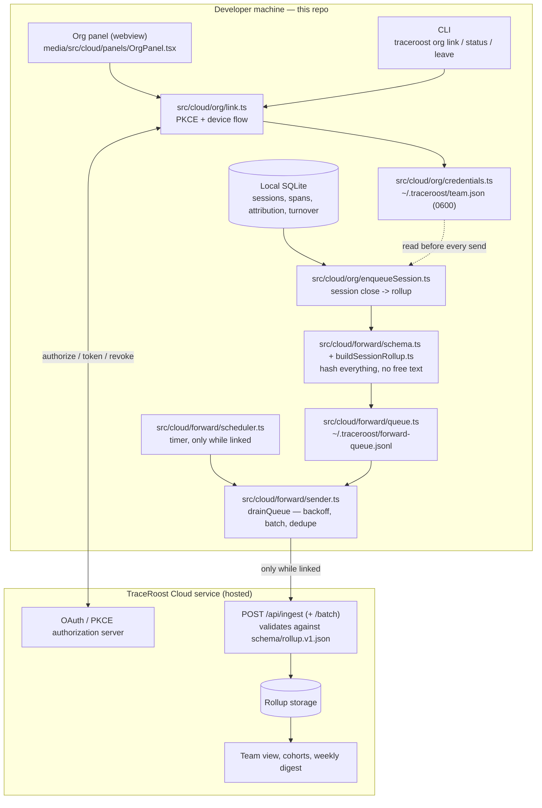

# TraceRoost Cloud Architecture

This is the entry point for the **cloud / org** feature set merged onto this branch from the
`pro/01`–`pro/09` series (`AL 01`–`AL 09` in the plan below). It indexes the deep-dive docs that
already exist rather than repeating them, and adds the diagrams none of them have yet.

**Start here, then go deep:**

| Doc | Covers |
| --- | --- |
| [ARCHITECTURE.md §15](ARCHITECTURE.md#15-traceroost-cloud--org-link) | The full module map, every file, the free/paid boundary, the outcome-metric engines, feature by feature |
| [`src/cloud/README.md`](src/cloud/README.md) | Why this code lives in one directory, and under a different license |
| [`NOTICE.md`](NOTICE.md) | The exact license split for this repository |
| [`schema/rollup.v1.json`](schema/rollup.v1.json) | The exact wire contract |

## The two rules everything below answers to

1. **Privacy is a property, not a promise.** An unlinked install makes no request to any
   TraceRoost service, ever. The wire format has no free-text field — there is nothing for source
   code to travel in even if a bug tried to send it.
2. **The free/paid line is single-player vs. multiplayer.** Everything about *my* machine, *my*
   commits, *my* repositories is free and complete. Paid is cross-developer aggregation — the one
   thing a local install genuinely cannot do itself. Nothing local is gated behind Cloud.

## The client owns the contract

This repo owns the wire schema; the hosted service only validates against it — never the
reverse, because the claim *"this client cannot send your code"* is only worth what it's worth
in the repository a skeptical developer already trusts.

```mermaid
graph TB
    subgraph Machine["Developer machine — this repo"]
        PANEL["Org panel (webview)<br/>media/src/cloud/panels/OrgPanel.tsx"]
        CLI["CLI<br/>traceroost org link / status / leave"]
        LINK["src/cloud/org/link.ts<br/>PKCE + device flow"]
        CRED["src/cloud/org/credentials.ts<br/>~/.traceroost/team.json (0600)"]
        ENQ["src/cloud/org/enqueueSession.ts<br/>session close -> rollup"]
        SCHEMA["src/cloud/forward/schema.ts + buildSessionRollup.ts<br/>hash everything, no free text"]
        QUEUE["src/cloud/forward/queue.ts<br/>~/.traceroost/forward-queue.jsonl"]
        SCHED["src/cloud/forward/scheduler.ts<br/>timer, only while linked"]
        SEND["src/cloud/forward/sender.ts<br/>drainQueue — backoff, batch, dedupe"]
        LOCAL[("Local SQLite<br/>sessions, spans, attribution, turnover")]
    end

    subgraph Service["TraceRoost Cloud service (hosted)"]
        OAUTH["OAuth / PKCE authorization server"]
        INGEST["POST /api/ingest (+ /batch)<br/>validates against schema/rollup.v1.json"]
        STORE[("Rollup storage")]
        VIEWS["Team view, cohorts, weekly digest"]
    end

    PANEL --> LINK
    CLI --> LINK
    LINK <-->|"authorize / token / revoke"| OAUTH
    LINK --> CRED
    LOCAL --> ENQ
    CRED -.->|"read before every send"| ENQ
    ENQ --> SCHEMA --> QUEUE
    SCHED --> SEND
    QUEUE --> SEND
    SEND -->|"only while linked"| INGEST
    INGEST --> STORE --> VIEWS
```

**Reading the diagram:** everything left of the repo boundary ships in this npm package / VSIX
and is inspectable by anyone. Nothing crosses to the right unless `credentials.ts` has a saved
credential — `ENQ`, `SCHED`, and `SEND` all check that first and return before touching disk or
network otherwise. `--explain-payload` (`standalone/cloud/explainPayload.ts`) prints exactly what
`SCHEMA` would build for a real session, so the claim above is checkable without an org at all.

## The free tier: fully local, no such diagram needed for privacy — but here's the pipeline

`src/attribution/` and `src/turnover/` have no network path in their dependency graph at all —
not gated, not disabled, structurally absent. (They lived under `src/cloud/` until they were moved
out so a core-only build can drop every cloud directory without losing them — see "What ships
where" below.) It's free forever, and reachable directly via
`traceroost cohort` — no org link required to run it yourself. There was previously a dedicated
free **Outcomes** dashboard tab surfacing it automatically; retired in commit `0ee7842` in favor of
inline git-outcome signal (merged/committed/abandoned) in the Sessions tab's Files sub-tab instead
(see `ARCHITECTURE.md` §10). The engine's only current caller is the cohort hand-off below.

```mermaid
graph LR
    GIT[("git log --numstat<br/>git blame --line-porcelain")] --> SCAN["attribution/commitScan.ts"]
    SCAN --> JOIN["attribution/sessionJoin.ts<br/>match commits to local sessions"]
    JOIN --> BLAME["attribution/blame.ts"]
    BLAME --> ATTR["attribution/index.ts<br/>attributeRepository()"]
    ATTR --> ADB[("attributionRepository<br/>SQLite cache")]
    ADB --> COH["turnover/cohorts.ts<br/>monthly cohorts"]
    COH --> SURV["turnover/survival.ts<br/>surviving-AI-lines estimate"]
    SURV --> COMP["turnover/index.ts<br/>computeTurnover()"]
    COMP --> TDB[("turnoverRepository<br/>one row per repo")]
    TDB --> CLI["standalone/local/cohortCli.ts<br/>traceroost cohort"]
```

`computeTurnover()` returns `TurnoverResult | InsufficientData` — never a bare percentage without
a line/commit count and date range attached, and a cohort is only measured once its window has
fully elapsed (`measurableAt` / `isWindowElapsed`). Confidence per commit is **certain** (agent
trailer, or the commit lands inside a session's own span), **probable** (session lists the file,
commit within a 72h lookback), or **unknown** — most commits on a real repo, and excluded from
the denominator rather than guessed at.

## What ships where

The Cloud rows below ship in the **full** edition only. The **core** edition (`node esbuild.js
--edition=core` — what releases are until Cloud launches; see runbooks/RELEASING.md → Editions)
contains none of it: the rest of the codebase reaches this feature set only through three seams —
`src/cloudBridge.ts`, `media/src/orgPanel.ts`, `standalone/cliCloud.ts` — whose core stubs are
inert (never linked, nothing queued or sent, Org panel renders nothing, `org` /
`--explain-payload` / `cluster` print "not available in the TraceRoost core edition" and exit 1).
The core build refuses to bundle any module under a `cloud/` directory, and
`scripts/check-edition.mjs` greps the shipped bundles for Cloud markers afterwards. The free rows
(marked *free*) work identically in both editions, except that a cloud `repo_hash` only resolves in
full.

| Surface | Entry point | Notes |
| --- | --- | --- |
| VS Code command palette | `TraceRoost: Link This Machine to an Org` / `… Org Link Status` / `… Leave Org` | `registerOrgCommands` in `src/extension.ts` (calls `cloud.*` from `src/cloudBridge.ts`; not registered, and not in the core `package.json`, in core) |
| VS Code webview | Org panel, a slide-in beside Settings | `media/src/cloud/panels/OrgPanel.tsx` (via `media/src/orgPanel.ts`) + `src/cloud/org/panelController.ts` (via `src/cloud/bridge.ts`) |
| Dashboard tab (free) | Sessions → Files sub-tab: git outcome banner + per-file badges | `gitOutcome.ts`; no dedicated tab today — see `ARCHITECTURE.md` §10. Retired the earlier **Outcomes** tab (`0ee7842`) |
| CLI | `traceroost org <link\|status\|leave> [--device]` | `standalone/cloud/org-cli.ts`, dispatched through `standalone/cliCloud.ts` → `standalone/cloud/cliBridge.ts` |
| CLI | `traceroost --explain-payload [--last\|--all\|--session <id>\|--since <date>] [--dry-run]` | `standalone/cloud/explainPayload.ts` (same seam) |
| CLI (free) | `traceroost advise <--list\|--apply <id>>` | `standalone/local/adviseCli.ts` — regenerates instruction text with real paths and appends it. The cloud step (suggestion ledger + a `SuggestionEvent` when linked) is `standalone/cloud/adviseTelemetry.ts`, passed in by `cli.ts` through `standalone/cliCloud.ts` (absent in core) |
| CLI (Cloud) | `traceroost cluster --repo <hash> --id <id>` | `standalone/cloud/clusterCli.ts` — resolves a Repeat work cluster via `GET /api/clusters/resolve`, matched against local sessions |
| CLI (free) | `traceroost cohort --repo <hash\|name> --merged <YYYY-MM> [--window]` | `standalone/local/cohortCli.ts` — the "show me an example" hand-off, answered on the machine that has the repo. A 64-hex `repo_hash` resolves through `src/cloud/org/resolveRepoHash.ts`, injected by `cli.ts` through `standalone/cliCloud.ts` (`standalone/local/repoResolve.ts`; absent in core); a repo name needs nothing from `cloud/` |
| CLI (free) | `traceroost find <hash>` | `standalone/local/findCli.ts` — classifies a hash as a session/trace or a repo and dispatches to `traceCli.ts` (`--id`) or `patternsCli.ts` accordingly; both share `sessionLoader.ts`, all under `standalone/local/`. Repo-hash resolution is injected the same way as `cohort` |
| Standalone HTTP | `GET/POST /api/org` | `standalone/server.ts`, dispatched through the same `panelController` as the VS Code webview (via `src/cloudBridge.ts`; the route doesn't exist in core) |
| Deep links | `vscode://agentlens.agentlens-dashboard/advise?id=…`, `vscode://agentlens.agentlens-dashboard/cohort?repo=…&merged=…&window=…` | Editor / example hand-off from a team view, without the service holding source. Routed through VS Code's own URI scheme, not a custom-registered one — see `src/extension.ts`'s "Deep links" comment |

## Every endpoint a linked machine calls

The full list — `src/cloud/org/config.ts` names each URL. All bearer calls authenticate with the
machine's access token, and the service scopes every one of them to that token's own
org/member/install; nothing takes an org, member or install id from the request. The client
requests no OAuth `scope` — the service issues one kind of machine token and doesn't enforce
scopes, so the endpoint list below *is* what a token can do.

| Endpoint | Caller | What it's for |
| --- | --- | --- |
| `GET /oauth/authorize` → loopback callback, `POST /oauth/token` (`authorization_code`) | `link.ts` (`linkInteractive`) | PKCE link. Mints a fresh install on every link. |
| `POST /oauth/device/code`, `POST /oauth/device/token` | `link.ts` (`linkViaDevice`) | RFC 8628 fallback for headless boxes. |
| `POST /oauth/token` (`refresh_token`) | `tokenRefresh.ts` | Rotates the pair. Under the credential file's lock, re-reading it first, so two hosts on one machine never rotate the same token (the loser's `invalid_grant` would otherwise unlink the machine). Proactive when `accessTokenExpiresAt` is within a minute. |
| `POST /oauth/revoke` | `link.ts` (`leave`) | Best-effort, after the local credential and queue are already gone; also revokes the install. |
| `POST /api/ingest/batch`, `POST /api/ingest` (fallback on 404) | `sender.ts` | Rollup delivery. 401 = expired/unknown token (refresh and retry once); 403 = install revoked (stop, clear credential and queue); 413 = too large (split / drop). |
| `GET /api/roster/me` | `oauthClient.ts` (`fetchRosterSelf`) | Org name, own role (`admin`/`developer`) and email for the Org panel. |
| `GET /api/installs/me` | `traceroost org verify` | How many sessions the service holds for *this install* — compared against the local count. A re-link's backfill moves already-stored sessions to the new install, so the counts line up again. |
| `GET /api/rates/effective` | `pricingSync.ts` (hourly) | The org's own rate table (central defaults + admin overrides). Only models with a real rate are listed; anything else keeps core's local rate. |
| `GET /api/clusters/resolve` | `traceroost cluster` (`clusterResolve.ts`) | A Repeat work cluster's session ids, matched locally through the same `toUuid` the rollups use. |

What goes over `/api/ingest` today: session rollups, and per-repo instruction telemetry
(`instructionTelemetry.ts`: instruction-file presence/line counts, which the service stores, plus
file footprints and suggestion events, which it accepts and does not yet store). The schema also
has commit and turnover records (`buildCommitRecords.ts`), but nothing builds and sends them yet —
which is why the consent list (`privacy.ts`, identical in both repos) doesn't promise line counts.

## One session, end to end (linked machine)

1. A session closes; `SessionStore` writes the `SessionSummaryCard` to local SQLite — unchanged
   from the free path.
2. `maybeEnqueueSession` (`src/cloud/org/enqueueSession.ts`) checks `loadCredentials()`. Unlinked →
   returns immediately, nothing else in this list runs.
3. Linked → `buildPayloadForCard` (`src/cloud/org/payloadPreview.ts`) turns the card into a
   `RollupPayload` via `buildSessionRollup.ts`: every field is a hash, enum, count, or timestamp;
   `repoKey.ts` derives the repository identifier from the local clone's root commit (HKDF/HMAC),
   never the repo name or path.
4. `ForwardQueue.enqueue()` appends it to `~/.traceroost/forward-queue.jsonl` (0600) if the
   idempotency key isn't already queued.
5. On its own timer — started only while linked — `drainQueue()` (`src/cloud/forward/sender.ts`) sends
   eligible items in batches (at most 25 items and ~400 KiB per request, under the service's
   512 KiB body cap), refreshing the access token just before it expires or on a 401, backing off
   with jitter on failure, dropping (never retrying) a 400 the schema rejects, splitting a batch
   the service answers 413 and dropping a single record that is too large on its own, and
   stopping entirely with one notice when the credential is gone for good — a 403 (the service's
   answer for a revoked install: an admin unlinked it, the member was removed, or the machine
   left) or a refresh rejected with `invalid_grant`. Both of those also **clear the queue**: every
   queued rollup was hashed with that org's salt and must never ship to the next org this machine
   links to (reconciliation re-enqueues after a re-link, hashed for the new org). `leave()` clears
   it the same way.
6. A 2xx removes the item from the queue. If the service is unreachable indefinitely, the queue
   just grows (capped at 5,000 items, oldest-first eviction — logged when it happens, not silent)
   — the developer's local dashboard is completely unaffected either way.

`leave()` reverses step 2 immediately: the credential is deleted and forwarding stops **before**
the server-side token revoke is even attempted, so leaving while offline still works.

## "Check for unsent traces" (on-demand reconcile)

The Org panel's button (also run automatically right after linking, and on every log-file
rediscovery) calls `reconcileLocalSessions` (`panelController.ts`), which runs steps 2–4 above for
*every* local session the host knows about, not just the one that just closed — so a newly linked
machine (or one that was offline) backfills its whole history instead of only reporting forward
from the link moment.

- **Runs a bounded 6-worker pool**, not one session at a time — `maybeEnqueueSession` calls for
  independent sessions overlap instead of fully serializing.
- **Shares one per-run cache** (`createPayloadBuildCache`, `payloadPreview.ts`) across the whole
  pool — repo-key derivation, branch lookup, and git-outcome classification are memoized per
  distinct workspace for the run's lifetime, since a developer's sessions cluster in a handful of
  repos. Nothing is cached across separate reconcile runs.
- **Sees every local session**, not capped at `MAX_SESSIONS_TO_WEBVIEW` — the VS Code host passes
  `listSessions({ limit: Infinity })` for this path specifically (`dashboardPanel.ts`).
- Once reconcile enqueues anything, `drainForwardQueueSoon()` (`scheduler.ts`) triggers a drain
  that **keeps going immediately while genuine backlog remains and nothing is stopping it** —
  instead of draining one 200-item batch and waiting up to 5 minutes for the next tick.

See `.staged-issues/reconcile-gap-and-latency.md`'s investigation for the reported symptom (the
button hanging for minutes on a real backlog) this was built against — file removed once
implemented; git history has it.

## Testing hooks worth knowing about

- `src/test/cloud/forward/schema.test.ts` walks `schema/rollup.v1.json` and fails the build if any
  string field is left unconstrained (no accidental free-text field).
- `src/test/cloud/org/privacy.test.ts` pins the exact `SENT` / `NEVER_SENT` lists shown on the
  consent screen.
- `standalone/cloud/explainPayload.ts` + its test assert the printed `--explain-payload` JSON equals
  what actually gets queued — the transparency claim is enforced, not just documented.
