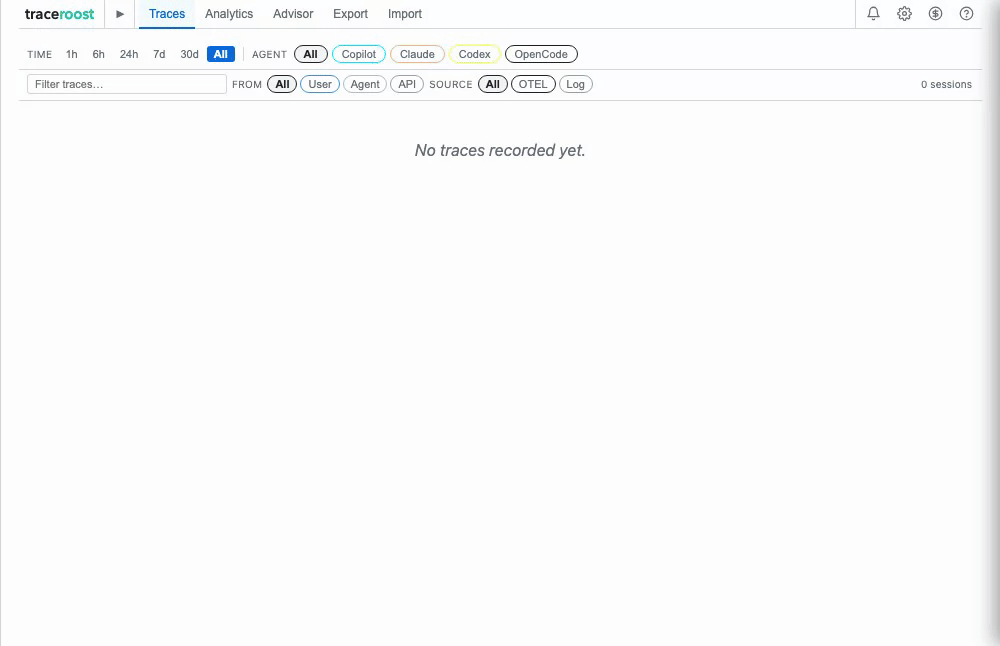

<h1> AgentLens</h1>

[](https://github.com/traceroost/core/actions/workflows/ci.yml)
[](LICENSE)



Local monitoring and observability for agentic AI coding tools — see what's actually happening inside each run. Nothing leaves your machine.

AgentLens receives **OpenTelemetry traces** from Copilot, Claude Code, and Codex in real time, giving you span timing, time-to-first-token, per-tool latency, and file diffs. It also reads the **local session files** each agent writes automatically — including OpenCode's **SQLite database** — as a zero-config fallback that backfills history from before you set anything up. Both sources appear in one dashboard; OTEL takes precedence when available.

Two things it does that a usage dashboard doesn't:

- **Catches agents that are stuck.** Five named loop and malfunction patterns — identical tool calls repeated, edits oscillating between two states, the same error recurring, runaway scope, context accumulating while progress collapses — each with a correction prompt you can paste straight into the session. [See the full list →](#recommendations--malfunction-detection)
- **Tells you what to fix in your instructions file.** The Advisor reads across sessions and suggests concrete additions to your CLAUDE.md or AGENTS.md — including hot files the agent rediscovers from scratch on every run. [More →](#features)

## Getting Started

### Local (OTEL and log files)

The fastest way to get started — run directly on your machine with no install required. Because it runs natively it has full access to your local session log files.

```bash
# One-off — the @latest tag forces a fresh fetch (see note below)
npx agentlens-dashboard@latest
bunx agentlens-dashboard@latest

# Or install globally and run by command name
npm install -g agentlens-dashboard@latest
agentlens
```

Open <http://localhost:3000> after the server starts. The OTLP receiver listens on port `4318`. Configure agents to point at `http://localhost:4318` (see [Manual Configuration](#manual-configuration)).

> **Always include `@latest`.** A bare `npx agentlens-dashboard` (or `bunx`) re-runs whatever
> version npx cached the first time you ran it — it does **not** check npm for a newer release, so
> you can silently stay on an old version for weeks. `@latest` forces npx to resolve against the
> registry. If a bare run already cached an old copy, clear it with `rm -rf ~/.npm/_npx` (npx) or
> `npm cache clean --force`. A global install (`npm install -g`) has the same trap — re-run it with
> `@latest`, or `npm update -g agentlens-dashboard`, to move forward.

> **Log file ingestion** reads local session files from `~/.claude/`, `~/.codex/`, `~/.copilot/`, and OpenCode's SQLite database at `~/.local/share/opencode/` directly. See [Local Mode Options](#local-mode-options) for environment variables.
>
> **Running this in a terminal only lasts until you close it.** If AgentLens isn't running when an agent sends OTEL data, that data is lost — see [Background Service](#background-service-macos--windows--linux) to keep it running automatically.

### VS Code Extension (OTEL and log files)

The extension receives OTEL traces in real time **and** reads local session log files, so you get both live telemetry and full session history automatically.

Works in **VS Code, Cursor, Windsurf, VSCodium, Trae, and Kiro** — install from your IDE's extension marketplace or from the VS Code Marketplace directly.

1. **[Install from the VS Code Marketplace](https://marketplace.visualstudio.com/items?itemName=agentlens.agentlens-dashboard)**
2. Open the **AgentLens** view from the Activity Bar — this opens a dashboard panel inside your IDE, not a browser tab, so there's no localhost URL to visit for this mode
3. AgentLens auto-configures OTEL telemetry for Copilot, Claude Code, and Codex — restart any running agent sessions to start streaming traces
4. Past session history loads automatically from local log files — no extra setup needed

### Docker (OTEL only)

> **Note:** Docker cannot read local session log files from your host machine without explicit volume mounts for each agent directory. Docker mode receives OTEL traces only — log file ingestion is not available. Use the local option above if you need log file history.

```bash
# Ephemeral — data cleared on container stop (always pulls latest)
docker run --pull=always -p 127.0.0.1:3000:3000 -p 127.0.0.1:4318:4318 agentlens/agentlens

# Persistent — data survives restarts (macOS/Linux)
docker run --pull=always -p 127.0.0.1:3000:3000 -p 127.0.0.1:4318:4318 \
  -v ~/.agentlens:/data \
  agentlens/agentlens

# Persistent — data survives restarts (Windows)
docker run --pull=always -p 127.0.0.1:3000:3000 -p 127.0.0.1:4318:4318 `
  -v "$env:USERPROFILE\.agentlens:/data" `
  agentlens/agentlens
```

Open <http://localhost:3000> after the container starts.

#### Configuring Agents for Local / Docker

Use the included setup scripts to configure agents automatically, or see [Manual Configuration](#manual-configuration) for the manual steps.

```bash
# macOS / Linux
chmod +x scripts/configure-agents.sh
./scripts/configure-agents.sh
```

```powershell
# Windows (PowerShell)
Set-ExecutionPolicy -ExecutionPolicy RemoteSigned -Scope CurrentUser
.\scripts\configure-agents.ps1
```

## Features

- **OpenTelemetry collection** — Built-in OTEL receiver captures real-time traces and logs from Copilot, Claude Code, and Codex with no external infrastructure; auto-configured on first activation
- **Log file ingestion** — Reads local session files and databases written automatically by each agent as a zero-config fallback — including JSONL logs for Claude Code, Codex, and Copilot, and OpenCode's SQLite database — backfilling history when OTEL isn't configured (VS Code-family IDEs and native process only)
- **Sessions Table** — Drill into any session: expand a row to see a full waterfall trace, turn-to-tool flow graph, tool distribution chart, and modified files — all without leaving the session list
- **Git Outcome Correlation** — For each file a session changed, compares its content before and after against local git history to show whether the work was committed, reverted, or left uncommitted — answers "did this session's changes actually survive?" after the fact (not available in Docker mode — same host git-repo access limitation as log file ingestion)
- **One-shot / Retry Rate** — Tracks what fraction of edited files reached their final state in a single edit pass vs. needed retries, per session and aggregated per-agent in Analytics — a proxy for correction effort
- **Analytics** — Aggregate charts across the active time range: per-agent breakdown, estimated cost with a daily total overlay, token usage per session, and context growth
- **Advisor** — Project-scoped suggestions for improving your agent instruction file (CLAUDE.md, AGENTS.md, or similar): detects hot files the agent rediscovers every session, loop patterns, high turn-count trends, and scope problems — each suggestion includes ready-to-copy instruction text and an inquiry prompt you can paste directly into your agent. Also includes an efficiency scatter plot (cost vs. LLM calls, colored by cache hit rate) and hot files ranked by access frequency. Select a specific project from the filter for tailored suggestions; all-projects view surfaces only universal patterns.
- **Cost Estimation** — Estimates session cost for Copilot (three billing models), Claude Code, and Codex, broken down by model in a day-grouped table
- **Efficiency & Inefficiency Detection** — Surfaces context bloat, redundant tool calls, cache misses, and five loop/malfunction patterns with suggested prompts to correct course
- **Configurable Alerts** — Threshold-based notifications for turns, errors, active time, repeat tool calls, and estimated daily cost — per-agent or shared
- **Export** — Export filtered sessions as JSON, CSV, or Markdown (full or redacted); respects the active agent, source, time range, and text filters
- **Import** — Import sessions from a previous AgentLens JSON export; drag-drop or file-pick, shows a preview with session count by source and date range, imports with live progress and automatic deduplication (existing sessions are skipped)
- **MCP Server** — Exposes your own session history to Claude Code (or any MCP-compatible agent) so it can query its recent work, cost, and recurring file/loop patterns before starting a task, instead of you checking the dashboard yourself. Runs by default on port `4316`; see the in-app Help tab's Agent Integration section for setup

## Data Sources

AgentLens collects data from two independent sources per agent. Each session row shows a badge — **OTEL** or **Log** — indicating where its data came from. If both capture the same session, OTEL always wins and the badge upgrades automatically.

### OpenTelemetry traces (primary source)

The VS Code extension runs a built-in OTEL HTTP receiver on port `4318` and auto-configures each agent on first activation. The native process and Docker modes also expose the same receiver. OTEL data is the richest source: real-time span timing, time-to-first-token, per-tool latency, loop detection signals, file diff content, and streaming speed. Sessions from OTEL show an **OTEL** badge.

See [Manual Configuration](#manual-configuration) for the specific settings each agent needs. OTEL is the only data source available in Docker mode.

### Log file ingestion (fallback source, VS Code-family IDEs and native process only)

AgentLens also reads the local session files that Claude Code, Codex, Copilot CLI, and Copilot Chat write automatically to your home directory. This requires no configuration and backfills session history that predates OTEL setup. Log-sourced sessions show a **Log** badge. **Not available in Docker mode** — the container cannot access host log directories without explicit volume mounts for every agent path.

| Agent | Log file location (Mac/Linux) | Windows |
| --- | --- | --- |
| **Claude Code** | `~/.claude/projects/<project>/<session>.jsonl` | `%APPDATA%\Claude\projects\...` |
| **Codex CLI** | `~/.codex/sessions/<project>/<session>.jsonl` | `%USERPROFILE%\.codex\sessions\...` |
| **Copilot CLI** | `~/.copilot/session-state/<session>/events.jsonl` | `%USERPROFILE%\.copilot\session-state\...` |
| **Copilot Chat** | `~/Library/Application Support/<IDE>/User/workspaceStorage/…/chatSessions/` | `%APPDATA%\<IDE>\User\workspaceStorage\…\chatSessions\` |
| **OpenCode** | `~/.local/share/opencode/opencode.db` (SQLite) | `%APPDATA%\opencode\opencode.db` |

Copilot Chat sessions are scanned across all installed VS Code-family IDEs automatically — VS Code, VS Code Insiders, Cursor, Windsurf, VSCodium, Trae, and Kiro.

Loading is incremental and runs in the background, sorted newest-first so recent sessions appear immediately. A 30-second poll picks up new sessions as they complete.

**What log data includes:** session ID, workspace, model, timestamps, token counts (input, output, cache read/write), tool calls and file operations (Claude Code and OpenCode), user prompt (Claude Code, Copilot CLI, and OpenCode).

**What log data does not include:** time-to-first-token, per-tool execution timing, streaming speed, loop detection signals, or structured error telemetry. Enable OTEL for those. OpenCode sessions show a blue info banner in the Session Overview noting that OTEL traces and TTFT are not available.

To disable log ingestion: set `agentLens.enableLogIngestion` to `false` in VS Code settings.

**Clear All Data** (Settings) only deletes AgentLens' own stored copy — it never touches these source log files, and log-sourced sessions will simply be re-read on the next scan. AgentLens has no way to delete the log files themselves; do that directly at the paths above if you want them gone.

## Cost Estimation

The **Analytics** tab (Estimated Cost section) shows the dollar cost of Copilot, Claude Code, and Codex sessions.

**Copilot** supports three billing models via a toggle:

| Mode | Who it applies to |
| ---- | ----------------- |
| **Token-based AI Credits** (default) | Default Copilot plans from June 1, 2026 — charges per input/output/cache token at per-model rates |
| **Annual plan request-based** | Annual-plan holders staying on request billing from June 1, 2026 — multiplier × $0.04 per user-initiated prompt |
| **Request-based** *(deprecated)* | Plans on request billing before June 1, 2026 — multiplier × $0.04 per user-initiated prompt |

**Claude Code** and **Codex** always use token-based pricing — no toggle required. Claude Code is billed against the Anthropic API at standard per-token rates (input, cache write, cache read, output) depending on model (Opus, Sonnet, or Haiku). Codex is billed against the OpenAI API.

The Estimated Cost section includes a per-session bar chart with a daily aggregate line (right axis), a multi-dimensional table grouped by date and agent showing input, output, cache create, cache read, total tokens, and cost, and a model breakdown table. Some models carry a "long context" surcharge above a per-model token-per-call threshold — see [PRICING_SOURCES.md](PRICING_SOURCES.md) for which ones and the exact thresholds.

All figures are estimates — not your actual bill. Rates are sourced from each provider's public pricing docs; see [PRICING_SOURCES.md](PRICING_SOURCES.md) for the authoritative URL for each billing model and notes for maintainers on keeping rates current.

## Exporting and Importing Session Data

### Export

The **Export** tab writes session summary files to your workspace root, in your choice of three formats:

- **JSON** (default) — full-fidelity structured export including prompt text, token counts, tool usage, file changes, and cost estimates for every recorded session. This is the only format the **Import** tab reads back in.
- **CSV** — one row per session, with array/object fields (models, files, tool counts, loop signals) flattened into semicolon-joined cells. Built for dropping into a spreadsheet.
- **Markdown** — one section per session with the same data laid out as a readable report, prompt included as a blockquote. Built for sharing.

Each format is available both as the full export and as a redacted export (prompt text and file paths replaced with `[redacted]`) — filenames follow `export_sessions_<timestamp>.<ext>` (or `export_redacted_sessions_<timestamp>.<ext>` for the redacted version), with `<ext>` matching the format chosen (`json`, `csv`, or `md`).

Exports draw from the full SQLite session history, not just the active window, so all past sessions are included regardless of when they ran.

> **Note:** Session summary exports cannot be replayed with `pnpm run demo --file`. Replay requires raw OTEL span data, which is not yet persisted to disk. This is tracked as a planned enhancement. See [DEMO.md](DEMO.md) for the full replay/demo toolchain.

### Import

The **Import** tab loads sessions from a previous AgentLens **JSON** export file into the current installation — useful for migrating data to a new machine, sharing session history across team members, or restoring a local backup. CSV and Markdown exports are one-way (for external consumption) and can't be imported back.

1. Open the **Import** tab in the dashboard
2. Drag-and-drop an `export_sessions_*.json` file onto the drop zone, or click **Choose file**
3. Review the preview: total sessions, breakdown by agent source, and the date range covered
4. Click **Import** — progress updates live as sessions are written; already-existing sessions are skipped automatically

Import works in both VS Code extension mode and standalone server mode.

## Recommendations & Malfunction Detection

The **Sessions** tab (Overview sub-tab) and **Analytics** tab surface two categories of signal per session:

**Efficiency insights** — problems you can fix by adjusting your prompts:

- Context bloat (input tokens growing rapidly across turns)
- Files read multiple times, duplicate searches, large tool results
- Tool failures, high turn count, oversized starting context
- Low cache hit rate, tool definition overhead

**Loop & malfunction signals** — patterns indicating the agent is stuck or spiraling. These appear first in the list with a ↺ icon:

| Signal | Description | Trigger |
| ------ | ----------- | ------- |
| **Tool Call Deadlock** | Same tool + arguments called 3+ times (critical at 5+) | Agent not retaining tool results |
| **State Corruption Spiral** | A file edited then reverted to a prior state | Agent oscillating between conflicting constraints |
| **Hallucination Amplification Loop** | Same error recurring 3+ times | Fix attempts not resolving the root cause |
| **Ambiguous Success / Escalating Scope** | Too many steps for the task complexity | No clear completion condition |
| **Infinite Loop — Context Accumulation** | Input tokens growing while output ratio collapses 70%+ | Agent stuck, accumulating context without progress |

Each signal includes a specific recommended action and a **Copy for {Agent}** button that copies the recommendation prompt to your clipboard so you can paste it into your AI session. Use the **Ignore** button to dismiss signals that represent intentional behavior.

## Manual Configuration

The VS Code extension and the standalone (`npx`) server both auto-configure Copilot, Claude Code, and Codex on every startup — it's idempotent, so it only rewrites a config file when something is actually missing or different, and does nothing on subsequent starts once already configured. The extension shows a one-time notification (and logs to the Output panel) only when it actually changes something; disable it with the `agentLens.autoConfigureAgents` setting if you'd rather manage agent config yourself. If you change an agent's OTEL settings by hand later and want AgentLens to reapply its own values, use the **Configure OTEL** button in the Settings panel (gear icon) instead of waiting for the next restart. Docker mode runs the same auto-configure code, but it writes to the *container's* filesystem, not your host machine, so it has no effect on your host agents unless you volume-mount their config paths in — use the setup scripts below instead. Replace `4318` with your custom port if you changed `agentLens.otlpPort`.

### GitHub Copilot

**VS Code-family IDE extension** — Add to User Settings (`Cmd+Shift+P` / `Ctrl+Shift+P` → *Preferences: Open User Settings (JSON)*) in VS Code, Cursor, Windsurf, or any VS Code-family IDE:

```json
{
  "github.copilot.chat.otel.enabled": true,
  "github.copilot.chat.otel.exporterType": "otlp-http",
  "github.copilot.chat.otel.otlpEndpoint": "http://localhost:4318"
}
```

**Copilot CLI (standalone)** — Add to your shell profile, then open a new terminal:

```bash
# macOS / Linux — add to ~/.zshrc or ~/.bashrc
export OTEL_EXPORTER_OTLP_ENDPOINT="http://localhost:4318"
export OTEL_INSTRUMENTATION_GENAI_CAPTURE_MESSAGE_CONTENT=true
```

```powershell
# Windows — run once in PowerShell (persists across sessions)
[System.Environment]::SetEnvironmentVariable("OTEL_EXPORTER_OTLP_ENDPOINT", "http://localhost:4318", "User")
[System.Environment]::SetEnvironmentVariable("OTEL_INSTRUMENTATION_GENAI_CAPTURE_MESSAGE_CONTENT", "true", "User")
```

---

### Claude Code

The CLI and VS Code extension both read the same file. Add to the `"env"` block:

- **macOS/Linux:** `~/.claude/settings.json`
- **Windows:** `%USERPROFILE%\.claude\settings.json`

```json
{
  "env": {
    "CLAUDE_CODE_ENABLE_TELEMETRY": "1",
    "CLAUDE_CODE_ENHANCED_TELEMETRY_BETA": "1",
    "OTEL_TRACES_EXPORTER": "otlp",
    "OTEL_EXPORTER_OTLP_PROTOCOL": "http/json",
    "OTEL_EXPORTER_OTLP_ENDPOINT": "http://localhost:4318",
    "OTEL_LOG_TOOL_DETAILS": "1",
    "OTEL_LOG_TOOL_CONTENT": "1",
    "OTEL_LOG_USER_PROMPTS": "1"
  }
}
```

`CLAUDE_CODE_ENHANCED_TELEMETRY_BETA=1` enables span-level tracing — without it turns and LLM calls are indistinguishable and cache token breakdowns are unavailable. The three `OTEL_LOG_*` vars unlock tool details, file diff content (needed for the Files tab), and your typed prompt. If `settings.json` already exists, merge the `env` block — do not replace the whole file.

---

### Codex

The CLI and VS Code extension both read the same file. Add an `[otel]` section:

- **macOS/Linux:** `~/.codex/config.toml`
- **Windows:** `%USERPROFILE%\.codex\config.toml`

```toml
[otel]
log_user_prompt = true
exporter = { otlp-http = { endpoint = "http://localhost:4318", protocol = "json" } }
trace_exporter = { otlp-http = { endpoint = "http://localhost:4318", protocol = "json" } }
```

`log_user_prompt = true` includes your typed prompt; without it sessions show `[session in progress]`. `exporter` sends log events; `trace_exporter` sends trace spans. Both point at the same endpoint. If `config.toml` already has an `[otel]` section, add only the missing keys.

## Local Mode Options

AgentLens runs as a local web server outside VS Code — useful for CI, remote machines, or when you prefer a browser tab over the VS Code sidebar.

### Native process (recommended for local use)

Runs directly on your machine — no Docker required. Gives the server full access to the local filesystem, which is required for log file ingestion. Quick-start commands are in [Getting Started](#local-otel-and-log-files) above.

Environment variables:

| Variable | Default | Description |
| --- | --- | --- |
| `OTLP_PORT` | `4318` | OTLP HTTP receiver port |
| `UI_PORT` | `3000` | Dashboard port |
| `MCP_PORT` | `4316` | MCP endpoint for Claude Code and other MCP-compatible agents |
| `DATA_DIR` | `~/.agentlens` | Directory for persistent span data |
| `BIND_HOST` | `127.0.0.1` | Set to `0.0.0.0` for LAN access |
| `AGENTLENS_MAX_SPANS` | `50000` | Cap on in-memory/persisted spans; oldest spans are dropped once exceeded |

The local server uses the same port as the VS Code extension — only one can run at a time. To run both simultaneously, use different ports:

```bash
OTLP_PORT=4319 UI_PORT=3001 bunx agentlens-dashboard@latest
```

### Background Service (macOS / Windows / Linux)

> **If AgentLens isn't running, incoming OTEL data has nowhere to go and is lost** — agents don't
> queue or retry failed exports. A terminal you forgot to reopen, a closed laptop lid, or a reboot
> all mean a gap in your session history. Running AgentLens as a background service avoids this:
> it starts automatically and keeps running without a terminal open.

```bash
# One command — works whether or not agentlens-dashboard is already installed globally
npx agentlens-dashboard@latest service install

agentlens service status      # check whether it's running and reachable
agentlens service logs        # print the service's log file
agentlens service logs --follow
agentlens service stop        # stop it
agentlens service start       # start it again
agentlens service update      # upgrade to the latest version and restart on it
agentlens service uninstall   # remove it (your data in ~/.agentlens is untouched)
```

`service install` fetches the latest `agentlens-dashboard` from npm before it writes the service
definition, so re-running it is also how you upgrade. If that download can't happen (offline, npm
registry unreachable), it prints a clear notice that the new version couldn't be downloaded and
installs the service on whichever version is already present rather than failing.

> **Once installed, the running service does not otherwise auto-update.** It keeps running whatever
> version is installed until you run `agentlens service update` (or re-run `service install`) —
> either one pulls the latest `agentlens-dashboard` from npm and restarts the service on it.

`service install` uses whichever OS-native mechanism fits your platform, all installed per-user
with no admin/root privileges required:

| Platform | Mechanism |
| --- | --- |
| macOS | `launchd` LaunchAgent — starts at login, restarts automatically if it crashes |
| Linux | `systemd --user` unit — starts at login; add `loginctl enable-linger $USER` if you want it to keep running even when logged out (e.g. a headless box) |
| Windows | Scheduled Task at logon — starts when you log in. (Windows has no simple no-admin equivalent to launchd/systemd's crash-restart; a true Windows Service is a heavier install requiring elevation and wasn't worth the extra friction for a per-user local tool) |

Ports and data directory can be customized at install time, and are remembered across
restarts in `~/.agentlens/config.json`:

```bash
agentlens service install --ui-port 3001 --otlp-port 4319 --data-dir ~/agentlens-data
```

Since `npx` always runs from a temporary cache with no stable path to launch from, running
`service install` under `npx` installs `agentlens-dashboard` globally first (equivalent to
`npm install -g agentlens-dashboard@latest`) so the service definition has something fixed to
point at.

### Docker (OTEL only)

> **Log file ingestion is not available in Docker mode.** The container is isolated from the host filesystem. Use the native process option above if you need local session log history.

Quick-start commands are in [Getting Started](#docker-otel-only). Additional options:

**LAN-accessible** — exposes the dashboard to other devices on your network:

```bash
docker run --pull=always -p 3000:3000 -p 4318:4318 -v ~/.agentlens:/data agentlens/agentlens
```

**Custom ports** — if `4318` is already in use by the VS Code extension:

```bash
docker run --pull=always -p 127.0.0.1:3001:3000 -p 127.0.0.1:4319:4318 \
  -v ~/.agentlens:/data \
  agentlens/agentlens
```

Then point your agents at `http://localhost:4319` and open <http://localhost:3001>.

### Node.js (from source)

Requires Node.js 18+ and this repository cloned locally.

```bash
pnpm install
pnpm run local
```

## Automation Prompts File

When an automation threshold is crossed, AgentLens can write the generated prompt to a markdown file. To act on it automatically, configure your agent to watch or include that file as an input — for example, by pointing Claude Code at it via a hook or referencing it in a system prompt. Without that wiring, the file serves as a persistent, reviewable log you can paste from manually. For simpler workflows, leave **Write prompts file** off and use the **Copy Prompt** notification button instead.

### How it works

When **Write prompts file** is enabled for an automation rule, each trigger appends a timestamped entry to an agent-specific file:

| Agent | File written |
| --- | --- |
| Claude Code | `agentlens-prompts-claude.md` |
| GitHub Copilot | `agentlens-prompts-copilot.md` |
| Codex | `agentlens-prompts-codex.md` |

In the VS Code extension, files are written to the workspace root. In local mode, files are written to the directory where the server is running.

Each entry uses this format:

```markdown
## 2026-05-21 14:30:22 — Loop Breaker

[AgentLens Automation: Loop Breaker]

...generated prompt...

---
```

When **Write prompts file** is off (default), triggering an automation shows a notification with a **Copy Prompt** button instead — click it to copy the prompt to your clipboard, then paste into your agent.

## VS Code Commands

Open the VS Code Command Palette (`Cmd+Shift+P` / `Ctrl+Shift+P`) and search for **AgentLens**:

| Command | Description |
| ------- | ----------- |
| `AgentLens: Open Dashboard` | Open the full dashboard in an editor panel |
| `AgentLens: Export OTEL Data` | Write session data to JSON files in your workspace root (also available in the **Export** dashboard tab) |
| `AgentLens: Export OTEL Data (Redacted)` | Same, with prompt text, tool inputs, tool results, and PII replaced with `[redacted]` |
| `AgentLens: Show Storage Stats` | Report local database size, blob storage size, session count, date range, and current retention setting to the Output panel |

## Extension Settings

| Setting | Default | Description |
| ------- | ------- | ----------- |
| `agentLens.otlpPort` | `4318` | Local port for the OTLP trace receiver |
| `agentLens.enableOtelIngestion` | `true` | Accept incoming OTEL span data. The OTLP server keeps listening on `agentLens.otlpPort` regardless; disabling this silently drops received payloads without storing them. |
| `agentLens.enableLogIngestion` | `true` | Read local session log files from Claude Code, Codex, and Copilot CLI. Disable if you only want OTEL data. |
| `agentLens.autoConfigureAgents` | `true` | Automatically write OTEL telemetry settings into Claude Code's, Codex's, and Copilot's own configuration on every activation. Disabling leaves your agents' configuration untouched — use the **Configure OTEL** button in Settings for a one-off manual apply, or configure OTEL manually (see [Manual Configuration](#manual-configuration)). |
| `agentLens.enableMcpServer` | `true` | Start the AgentLens MCP server so Claude Code and other MCP-compatible agents can query your session history. |
| `agentLens.mcpPort` | `4316` | Local port for the AgentLens MCP server (when `agentLens.enableMcpServer` is true) |
| `agentLens.sessionRetentionDays` | `90` | How many days to keep session history in the local database |

## Agent Data Formats

AgentLens collects data from two sources per agent and normalizes both into a shared session model. The **Log** badge indicates log-file data; **OTEL** indicates telemetry data. When both are present for the same session, OTEL wins.

### Claude Code

**Log files** (automatic, no setup) — `~/.claude/projects/<project>/<session-uuid>.jsonl`

Each file is one session. `assistant` entries carry per-turn token counts (input, output, cache read/write). `user` entries carry the prompt text. Tool calls are embedded in message content blocks.

Available from logs: prompt, model, workspace, timestamps, all token counts, tool names, files read/written.
Not in logs: TTFT, per-tool latency, streaming speed, loop signals.

**OTEL** (richer, requires env config) — trace spans via `/v1/traces` and supplemental log records via `/v1/logs`.

With the recommended configuration (all three `OTEL_LOG_*` vars): prompt text, token counts, model, tool names, tool arguments, file paths, and full file diff content are all available. The three `OTEL_LOG_*` vars are not enabled by default — without them, tool arguments are absent and prompt text is omitted.

---

### Codex CLI

**Log files** (automatic, no setup) — `~/.codex/sessions/<project>/<session-uuid>.jsonl`

`turn_context` entries carry the model name. `event_msg` entries with `type: token_count` carry per-turn cumulative token usage. The user's prompt text is not present in this format.

Available from logs: model, timestamps, token counts (input, output, cache read).
Not in logs: prompt text, tool names, TTFT, latency.

**OTEL** (richer, requires config) — primarily flat OTLP log records (`/v1/logs`); adding `trace_exporter` also emits timing spans. With `log_user_prompt = true` and both exporters: prompt text, token counts, model, TTFT, tool names and results, and span timing are all present.

---

### Copilot CLI

**Log files** (automatic, no setup) — `~/.copilot/session-state/<session-uuid>/events.jsonl`

`session.start` carries the model and workspace. `user.message` carries the user prompt. `assistant.message` carries per-turn output token counts. `session.shutdown` carries total context size.

Available from logs: prompt, model, workspace, timestamps, output tokens, total context size, tool names.
Not in logs: input tokens per turn (estimated from shutdown totals), TTFT, cache token breakdown.

**OTEL** (richer, requires VS Code settings) — trace spans via Copilot's built-in OTEL exporter. Prompt text, token counts (input, output, cache read), model, TTFT, tool names, arguments, and results are all present natively. Cache write counts are not exposed — Copilot manages cache creation server-side.

---

---

### OpenCode

**SQLite database (automatic, no OTEL setup needed)** — `~/.local/share/opencode/opencode.db`

OpenCode stores all session data in a local SQLite database. AgentLens reads this directly — no agent configuration or OTEL setup is required. The database uses WAL (Write-Ahead Log) mode; AgentLens merges the WAL at read time so sessions are visible immediately after each run.

Available from the database: session ID, user prompt (last user message), model name, workspace directory, timestamps, all token counts (input, output, cache read/write), tool calls with names and inputs/outputs, file paths accessed by tools.

Not available: time-to-first-token, per-tool execution timing, streaming speed, loop detection signals, or structured error telemetry (no OTEL). Sessions show a **Log** badge and a blue info banner in the Overview tab noting these limitations.

Override the default database location with the `OPENCODE_DATA_DIR` environment variable (comma-separated for multiple directories).

---

> **Note:** Agent observability is evolving rapidly. All platforms are actively expanding what they expose, and the GenAI semantic conventions are still being standardized. AgentLens will be updated as richer data becomes available.

## Additional Features

- **Files Changed** — The Files sub-tab tracks every file created or modified by the agent, organized by session with inline before/after diffs, a one-shot/retry-rate summary, and (VS Code extension only) a git-outcome banner showing whether each file's changes were committed, reverted, or left uncommitted
- **Multi-session Comparison** — The Analytics tab shows per-agent breakdown cards with side-by-side token totals, cache rates, TTFT, and top tools for Copilot, Claude, and Codex
- **Automated Prompts** — The gear-icon Settings panel's Automation section lets you configure threshold-based automations (Loop Breaker, Turn Limit Wrap-up, Context Dump) that trigger a correction prompt when a session crosses a limit — delivered as a VS Code notification or written to a file for agent consumption

## AI Usage Disclosure

AgentLens was built primarily with [Claude](https://www.anthropic.com/claude). Thank you to Anthropic for building tools that make projects like this possible.

## License

MIT

## Disclaimer

AgentLens is an independent open-source project and is not affiliated with, endorsed by, or associated with GitHub, Inc. or Microsoft Corporation (GitHub Copilot); Anthropic, PBC (Claude / Claude Code); or OpenAI, LLC (Codex CLI). All product names, trademarks, and registered trademarks are the property of their respective owners. AgentLens interacts with these products solely through their publicly documented OpenTelemetry telemetry interfaces.
